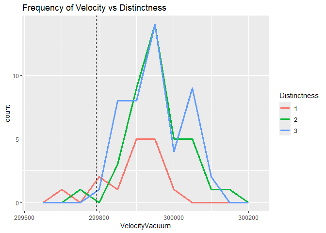

Michelson Speed-of-light Measurements
================
Oliver Buchwald
2025-02-12

- [Grading Rubric](#grading-rubric)
  - [Individual](#individual)
  - [Submission](#submission)
    - [**q1** Re-create the following table (from Michelson (1880),
      pg. 139) using `df_michelson` and `dplyr`. Note that your values
      *will not* match those of Michelson *exactly*; why might this
      be?](#q1-re-create-the-following-table-from-michelson-1880-pg-139-using-df_michelson-and-dplyr-note-that-your-values-will-not-match-those-of-michelson-exactly-why-might-this-be)
    - [**q2** Create a new variable `VelocityVacuum` with the $+92$ km/s
      adjustment to `Velocity`. Assign this new dataframe to
      `df_q2`.](#q2-create-a-new-variable-velocityvacuum-with-the-92-kms-adjustment-to-velocity-assign-this-new-dataframe-to-df_q2)
    - [**q3** Compare Michelson’s speed of light estimate against the
      modern speed of light value. Is Michelson’s estimate of the error
      (his uncertainty) greater or less than the true
      error?](#q3-compare-michelsons-speed-of-light-estimate-against-the-modern-speed-of-light-value-is-michelsons-estimate-of-the-error-his-uncertainty-greater-or-less-than-the-true-error)
    - [**q4** Inspect the following plot with the `Real` Michelson data
      and `Simulated` data from a probability model. Document the
      similarities and differences between the data under *observe*
      below.](#q4-inspect-the-following-plot-with-the-real-michelson-data-and-simulated-data-from-a-probability-model-document-the-similarities-and-differences-between-the-data-under-observe-below)
    - [**q5** You have access to a few other variables. Construct a **at
      least three** visualizations of `VelocityVacuum` against these
      other factors. Are there other patterns in the data that might
      help explain the difference between Michelson’s estimate and
      `LIGHTSPEED_VACUUM`?](#q5-you-have-access-to-a-few-other-variables-construct-a-at-least-three-visualizations-of-velocityvacuum-against-these-other-factors-are-there-other-patterns-in-the-data-that-might-help-explain-the-difference-between-michelsons-estimate-and-lightspeed_vacuum)
  - [Bibliography](#bibliography)

*Purpose*: When studying physical problems, there is an important
distinction between *error* and *uncertainty*. The primary purpose of
this challenge is to dip our toes into these factors by analyzing a real
dataset.

*Reading*: [Experimental Determination of the Velocity of
Light](https://play.google.com/books/reader?id=343nAAAAMAAJ&hl=en&pg=GBS.PA115)
(Optional)

<!-- include-rubric -->

# Grading Rubric

<!-- -------------------------------------------------- -->

Unlike exercises, **challenges will be graded**. The following rubrics
define how you will be graded, both on an individual and team basis.

## Individual

<!-- ------------------------- -->

| Category | Needs Improvement | Satisfactory |
|----|----|----|
| Effort | Some task **q**’s left unattempted | All task **q**’s attempted |
| Observed | Did not document observations, or observations incorrect | Documented correct observations based on analysis |
| Supported | Some observations not clearly supported by analysis | All observations clearly supported by analysis (table, graph, etc.) |
| Assessed | Observations include claims not supported by the data, or reflect a level of certainty not warranted by the data | Observations are appropriately qualified by the quality & relevance of the data and (in)conclusiveness of the support |
| Specified | Uses the phrase “more data are necessary” without clarification | Any statement that “more data are necessary” specifies which *specific* data are needed to answer what *specific* question |
| Code Styled | Violations of the [style guide](https://style.tidyverse.org/) hinder readability | Code sufficiently close to the [style guide](https://style.tidyverse.org/) |

## Submission

<!-- ------------------------- -->

Make sure to commit both the challenge report (`report.md` file) and
supporting files (`report_files/` folder) when you are done! Then submit
a link to Canvas. **Your Challenge submission is not complete without
all files uploaded to GitHub.**

``` r
# Libraries
library(tidyverse)
library(googlesheets4)

url <- "https://docs.google.com/spreadsheets/d/1av_SXn4j0-4Rk0mQFik3LLr-uf0YdA06i3ugE6n-Zdo/edit?usp=sharing"

# Parameters
LIGHTSPEED_VACUUM    <- 299792.458 # Exact speed of light in a vacuum (km / s)
LIGHTSPEED_MICHELSON <- 299944.00  # Michelson's speed estimate (km / s)
LIGHTSPEED_PM        <- 51         # Michelson error estimate (km / s)
```

*Background*: In 1879 Albert Michelson led an experimental campaign to
measure the speed of light. His approach was a development upon the
method of Foucault\[3\], and resulted in a new estimate of
$v_0 = 299944 \pm 51$ kilometers per second (in a vacuum). This is very
close to the modern *exact* value of 2.9979246^{5}. In this challenge,
you will analyze Michelson’s original data, and explore some of the
factors associated with his experiment.

I’ve already copied Michelson’s data from his 1880 publication; the code
chunk below will load these data from a public googlesheet.

*Aside*: The speed of light is *exact* (there is **zero error** in the
value `LIGHTSPEED_VACUUM`) because the meter is actually
[*defined*](https://en.wikipedia.org/wiki/Metre#Speed_of_light_definition)
in terms of the speed of light!

``` r
## Note: No need to edit this chunk!
gs4_deauth()
ss <- gs4_get(url)
df_michelson <-
  read_sheet(ss) %>%
  select(Date, Distinctness, Temp, Velocity) %>%
  mutate(Distinctness = as_factor(Distinctness))
```

    ## ✔ Reading from "michelson1879".

    ## ✔ Range 'Sheet1'.

``` r
df_michelson %>% glimpse()
```

    ## Rows: 100
    ## Columns: 4
    ## $ Date         <dttm> 1879-06-05, 1879-06-07, 1879-06-07, 1879-06-07, 1879-06-…
    ## $ Distinctness <fct> 3, 2, 2, 2, 2, 2, 3, 3, 3, 3, 2, 2, 2, 2, 2, 1, 3, 3, 2, …
    ## $ Temp         <dbl> 76, 72, 72, 72, 72, 72, 83, 83, 83, 83, 83, 90, 90, 71, 7…
    ## $ Velocity     <dbl> 299850, 299740, 299900, 300070, 299930, 299850, 299950, 2…

*Data dictionary*:

- `Date`: Date of measurement
- `Distinctness`: Distinctness of measured images: 3 = good, 2 = fair, 1
  = poor
- `Temp`: Ambient temperature (Fahrenheit)
- `Velocity`: Measured speed of light (km / s)

### **q1** Re-create the following table (from Michelson (1880), pg. 139) using `df_michelson` and `dplyr`. Note that your values *will not* match those of Michelson *exactly*; why might this be?

| Distinctness | n   | MeanVelocity |
|--------------|-----|--------------|
| 3            | 46  | 299860       |
| 2            | 39  | 299860       |
| 1            | 15  | 299810       |

``` r
## TODO: Compute summaries
df_q1 <- df_michelson %>%
  group_by(Distinctness)  %>%
  summarize(
    n=n(),
    MeanVelocity = mean(Velocity))

df_q1 %>%
  arrange(desc(Distinctness)) %>%
  knitr::kable()
```

| Distinctness |   n | MeanVelocity |
|:-------------|----:|-------------:|
| 3            |  46 |     299861.7 |
| 2            |  39 |     299858.5 |
| 1            |  15 |     299808.0 |

**Observations**: - Write your observations here!

- Mean velocity is around 299850

- Most observations have good distinctness

\- Why might your table differ from Michelson’s?

- It appears that Michelson’s table of velocities is rounded relative to
  mine. The numbers are effectively the same, but mine have decimals
  while his only go to the tens place.

The `Velocity` values in the dataset are the speed of light *in air*;
Michelson introduced a couple of adjustments to estimate the speed of
light in a vacuum. In total, he added $+92$ km/s to his mean estimate
for `VelocityVacuum` (from Michelson (1880), pg. 141). While the
following isn’t fully rigorous ($+92$ km/s is based on the mean
temperature), we’ll simply apply this correction to all the observations
in the dataset.

### **q2** Create a new variable `VelocityVacuum` with the $+92$ km/s adjustment to `Velocity`. Assign this new dataframe to `df_q2`.

``` r
## TODO: Adjust the data, assign to df_q2
df_q2 <- 
  df_michelson %>%
  mutate(
    VelocityVacuum = Velocity + 92
  )


df_q2 %>%
  arrange(desc(Distinctness)) %>%
  knitr::kable()
```

| Date       | Distinctness | Temp | Velocity | VelocityVacuum |
|:-----------|:-------------|-----:|---------:|---------------:|
| 1879-06-05 | 3            |   76 |   299850 |         299942 |
| 1879-06-09 | 3            |   83 |   299950 |         300042 |
| 1879-06-09 | 3            |   83 |   299980 |         300072 |
| 1879-06-09 | 3            |   83 |   299980 |         300072 |
| 1879-06-09 | 3            |   83 |   299880 |         299972 |
| 1879-06-13 | 3            |   72 |   300000 |         300092 |
| 1879-06-13 | 3            |   72 |   300000 |         300092 |
| 1879-06-13 | 3            |   79 |   299960 |         300052 |
| 1879-06-13 | 3            |   79 |   299960 |         300052 |
| 1879-06-13 | 3            |   79 |   299940 |         300032 |
| 1879-06-13 | 3            |   79 |   299960 |         300052 |
| 1879-06-13 | 3            |   79 |   299940 |         300032 |
| 1879-06-13 | 3            |   79 |   299880 |         299972 |
| 1879-06-13 | 3            |   79 |   299800 |         299892 |
| 1879-06-17 | 3            |   77 |   299800 |         299892 |
| 1879-06-17 | 3            |   77 |   299880 |         299972 |
| 1879-06-17 | 3            |   77 |   299880 |         299972 |
| 1879-06-17 | 3            |   77 |   299880 |         299972 |
| 1879-06-17 | 3            |   77 |   299860 |         299952 |
| 1879-06-20 | 3            |   60 |   299880 |         299972 |
| 1879-06-20 | 3            |   61 |   299910 |         300002 |
| 1879-06-21 | 3            |   80 |   299770 |         299862 |
| 1879-06-21 | 3            |   81 |   299760 |         299852 |
| 1879-06-21 | 3            |   82 |   299740 |         299832 |
| 1879-06-21 | 3            |   82 |   299750 |         299842 |
| 1879-06-21 | 3            |   81 |   299760 |         299852 |
| 1879-06-23 | 3            |   89 |   299910 |         300002 |
| 1879-06-23 | 3            |   89 |   299920 |         300012 |
| 1879-06-23 | 3            |   90 |   299890 |         299982 |
| 1879-06-23 | 3            |   90 |   299860 |         299952 |
| 1879-06-23 | 3            |   90 |   299880 |         299972 |
| 1879-06-24 | 3            |   72 |   299720 |         299812 |
| 1879-06-24 | 3            |   73 |   299840 |         299932 |
| 1879-06-24 | 3            |   74 |   299850 |         299942 |
| 1879-06-24 | 3            |   75 |   299850 |         299942 |
| 1879-06-24 | 3            |   76 |   299780 |         299872 |
| 1879-06-27 | 3            |   73 |   299780 |         299872 |
| 1879-06-27 | 3            |   74 |   299810 |         299902 |
| 1879-06-27 | 3            |   75 |   299760 |         299852 |
| 1879-06-27 | 3            |   75 |   299810 |         299902 |
| 1879-06-27 | 3            |   76 |   299790 |         299882 |
| 1879-06-27 | 3            |   76 |   299810 |         299902 |
| 1879-07-02 | 3            |   86 |   299950 |         300042 |
| 1879-07-02 | 3            |   86 |   299800 |         299892 |
| 1879-07-02 | 3            |   86 |   299810 |         299902 |
| 1879-07-02 | 3            |   85 |   299870 |         299962 |
| 1879-06-07 | 2            |   72 |   299740 |         299832 |
| 1879-06-07 | 2            |   72 |   299900 |         299992 |
| 1879-06-07 | 2            |   72 |   300070 |         300162 |
| 1879-06-07 | 2            |   72 |   299930 |         300022 |
| 1879-06-07 | 2            |   72 |   299850 |         299942 |
| 1879-06-09 | 2            |   83 |   300000 |         300092 |
| 1879-06-10 | 2            |   90 |   299980 |         300072 |
| 1879-06-10 | 2            |   90 |   299930 |         300022 |
| 1879-06-12 | 2            |   71 |   299650 |         299742 |
| 1879-06-12 | 2            |   71 |   299760 |         299852 |
| 1879-06-13 | 2            |   72 |   299960 |         300052 |
| 1879-06-17 | 2            |   62 |   299800 |         299892 |
| 1879-06-17 | 2            |   63 |   299790 |         299882 |
| 1879-06-18 | 2            |   75 |   299860 |         299952 |
| 1879-06-18 | 2            |   75 |   299970 |         300062 |
| 1879-06-18 | 2            |   75 |   299950 |         300042 |
| 1879-06-20 | 2            |   62 |   299850 |         299942 |
| 1879-06-20 | 2            |   63 |   299870 |         299962 |
| 1879-06-20 | 2            |   78 |   299840 |         299932 |
| 1879-06-20 | 2            |   79 |   299840 |         299932 |
| 1879-06-20 | 2            |   80 |   299850 |         299942 |
| 1879-06-20 | 2            |   79 |   299840 |         299932 |
| 1879-06-20 | 2            |   79 |   299840 |         299932 |
| 1879-06-20 | 2            |   79 |   299840 |         299932 |
| 1879-06-21 | 2            |   61 |   299890 |         299982 |
| 1879-06-21 | 2            |   62 |   299810 |         299902 |
| 1879-06-21 | 2            |   63 |   299810 |         299902 |
| 1879-06-21 | 2            |   64 |   299820 |         299912 |
| 1879-06-21 | 2            |   65 |   299800 |         299892 |
| 1879-06-26 | 2            |   86 |   299890 |         299982 |
| 1879-06-26 | 2            |   86 |   299840 |         299932 |
| 1879-06-30 | 2            |   85 |   299820 |         299912 |
| 1879-06-30 | 2            |   86 |   299850 |         299942 |
| 1879-06-30 | 2            |   86 |   299870 |         299962 |
| 1879-06-30 | 2            |   86 |   299870 |         299962 |
| 1879-07-01 | 2            |   83 |   299810 |         299902 |
| 1879-07-01 | 2            |   84 |   299740 |         299832 |
| 1879-07-01 | 2            |   86 |   299810 |         299902 |
| 1879-07-01 | 2            |   86 |   299940 |         300032 |
| 1879-06-12 | 1            |   71 |   299810 |         299902 |
| 1879-06-14 | 1            |   64 |   299850 |         299942 |
| 1879-06-14 | 1            |   64 |   299880 |         299972 |
| 1879-06-14 | 1            |   65 |   299900 |         299992 |
| 1879-06-14 | 1            |   66 |   299840 |         299932 |
| 1879-06-14 | 1            |   67 |   299830 |         299922 |
| 1879-06-14 | 1            |   84 |   299790 |         299882 |
| 1879-06-14 | 1            |   85 |   299810 |         299902 |
| 1879-06-14 | 1            |   84 |   299880 |         299972 |
| 1879-06-14 | 1            |   84 |   299880 |         299972 |
| 1879-06-14 | 1            |   84 |   299830 |         299922 |
| 1879-06-17 | 1            |   64 |   299760 |         299852 |
| 1879-06-18 | 1            |   58 |   299720 |         299812 |
| 1879-06-18 | 1            |   58 |   299720 |         299812 |
| 1879-06-18 | 1            |   59 |   299620 |         299712 |

As part of his study, Michelson assessed the various potential sources
of error, and provided his best-guess for the error in his
speed-of-light estimate. These values are provided in
`LIGHTSPEED_MICHELSON`—his nominal estimate—and
`LIGHTSPEED_PM`—plus/minus bounds on his estimate. Put differently,
Michelson believed the true value of the speed-of-light probably lay
between `LIGHTSPEED_MICHELSON - LIGHTSPEED_PM` and
`LIGHTSPEED_MICHELSON + LIGHTSPEED_PM`.

Let’s introduce some terminology:\[2\]

- **Error** is the difference between a true value and an estimate of
  that value; for instance `LIGHTSPEED_VACUUM - LIGHTSPEED_MICHELSON`.
- **Uncertainty** is an analyst’s *assessment* of the error.

Since a “true” value is often not known in practice, one generally does
not know the error. The best they can do is quantify their degree of
uncertainty. We will learn some means of quantifying uncertainty in this
class, but for many real problems uncertainty includes some amount of
human judgment.\[2\]

### **q3** Compare Michelson’s speed of light estimate against the modern speed of light value. Is Michelson’s estimate of the error (his uncertainty) greater or less than the true error?

``` r
## TODO: Compare Michelson's estimate and error against the true value
## Your code here!
tibble(
  Lower_Bound = LIGHTSPEED_MICHELSON - LIGHTSPEED_PM,
  Upper_Bound = LIGHTSPEED_MICHELSON + LIGHTSPEED_PM,
  True_speed = LIGHTSPEED_VACUUM
)
```

    ## # A tibble: 1 × 3
    ##   Lower_Bound Upper_Bound True_speed
    ##         <dbl>       <dbl>      <dbl>
    ## 1      299893      299995    299792.

**Observations**: - Is Michelson’s estimate of the error (his
uncertainty) greater or less than the true error? - (Your response
here) - Make a quantitative comparison between Michelson’s uncertainty
and his error. - (Your response here)

The following plot shows all of Michelson’s data as a [control
chart](https://en.wikipedia.org/wiki/Control_chart); this sort of plot
is common in manufacturing, where it is used to help determine if a
manufacturing process is under [statistical
control](https://en.wikipedia.org/wiki/Statistical_process_control).
Each dot is one of Michelson’s measurements, and the grey line connects
the mean taken for each day. The same plot also shows simulated data
using a probability model. We’ll get into statistics later in the
course; for now, let’s focus on understanding what real and simulated
data tend to look like.

### **q4** Inspect the following plot with the `Real` Michelson data and `Simulated` data from a probability model. Document the similarities and differences between the data under *observe* below.

``` r
## Note: No need to edit this chunk!
## Calibrate simulated data
v_mean <-
  df_q2 %>%
  summarize(m = mean(VelocityVacuum)) %>%
  pull(m)
v_sd <-
  df_q2 %>%
  summarize(s = sd(VelocityVacuum)) %>%
  pull(s)

## Visualize
set.seed(101)
df_q2 %>%
  mutate(Simulated = rnorm(n(), mean = v_mean, sd = v_sd)) %>%
  rename(Real = VelocityVacuum) %>%
  pivot_longer(
    cols = c(Simulated, Real),
    names_to = "source",
    values_to = "velocity"
  ) %>%

  ggplot(aes(Date, velocity)) +
  geom_hline(
    yintercept = LIGHTSPEED_MICHELSON,
    linetype = "dotted"
  ) +
  geom_hline(
    yintercept = LIGHTSPEED_MICHELSON - LIGHTSPEED_PM,
    linetype = "dashed"
  ) +
  geom_hline(
    yintercept = LIGHTSPEED_MICHELSON + LIGHTSPEED_PM,
    linetype = "dashed"
  ) +

  geom_line(
    data = . %>%
      group_by(Date, source) %>%
      summarize(velocity_mean = mean(velocity)),
    mapping = aes(y = velocity_mean),
    color = "grey50"
  ) +
  geom_point(
    mapping = aes(y = velocity),
    size = 0.8
  ) +

  facet_grid(source~.) +
  theme_minimal() +
  labs(
    x = "Date of Measurement (1879)",
    y = "Velocity (in Vacuum)"
  )
```

    ## `summarise()` has grouped output by 'Date'. You can override using the
    ## `.groups` argument.

<!-- -->

**Observations**:

Similarities

- The general shape of peaks and valleys day to day seems to roughly
  line up

- The majority of values, both real and simulated, falls within
  Michelson’s error margins, but there are notable outliers on both

Differences

- The simulated data has a more consistent amount of variation. The real
  data has some days where the measurements are fairly consistent, but
  some days where there’s a much wider spread. The simulated data seems
  a bit more consistent in the range from maximum to minimum value in a
  given day

- The day-day mean of the data shown on the trend line stays within the
  error margins more often for the simulated data than real data.

### **q5** You have access to a few other variables. Construct a **at least three** visualizations of `VelocityVacuum` against these other factors. Are there other patterns in the data that might help explain the difference between Michelson’s estimate and `LIGHTSPEED_VACUUM`?

Comparison of Velocity to day of the week

``` r
df_q5 <- 
  df_q2 %>%
  mutate(
    Day = wday(Date, label = TRUE)
  )
#plot qty and Distinctness vs day of week
df_q5 %>%
  ggplot(aes(Day, fill = Distinctness)) +
  geom_bar() +
  labs(title = 'Quantity and Dsitinctiveness by Day of Week')
```

<!-- -->

``` r
#plot frequency vs day of week
df_q5 %>%
  ggplot(aes(VelocityVacuum, color = Day)) +
  geom_freqpoly(bins = 10) +
  geom_vline(xintercept = LIGHTSPEED_VACUUM, linetype = "dashed") +
  labs(title = 'Frequency of Velocity by Day of Week')
```

<!-- -->

``` r
#plot density vs day of week
df_q5 %>%
  ggplot(aes(VelocityVacuum, color = Day)) +
  geom_density(size = 1.25)  +
  geom_vline(xintercept = LIGHTSPEED_VACUUM, linetype = "dashed") +
  labs(title = 'Density of Velocity by Day of Week')
```

    ## Warning: Using `size` aesthetic for lines was deprecated in ggplot2 3.4.0.
    ## ℹ Please use `linewidth` instead.
    ## This warning is displayed once every 8 hours.
    ## Call `lifecycle::last_lifecycle_warnings()` to see where this warning was
    ## generated.

<!-- -->

``` r
df_q5 %>%
  ggplot(aes(x = Day, y = VelocityVacuum, fill = Day)) +
  geom_boxplot() + 
  geom_hline(yintercept = LIGHTSPEED_VACUUM, linetype = "dashed") +
  labs(title = 'Frequency of Velocity by Day of Week')
```

<!-- -->

**Observations**:

- These plots show a variety of visualizations corresponding day of the
  week to Michelson’s measured lightspeed.
- The observations of velocity are consistently higher than our known
  value for the exact speed of light. There are only a handful of
  overall observations that fall below the actual constant, and all of
  them took place on a Wednesday or Thursday.
- Michelson’s team appears to be working 6-day weeks, and taking Sundays
  off.
- On Wednesdays, the observations seem to be quite a bit less consistent
  than other days of the week. There is a much less defined mode on the
  density plot for Wednesdays, and the box plot shows the widest range
  for that day.

``` r
df_q5 %>%
  ggplot(aes(VelocityVacuum, color = Distinctness)) +
  geom_density(size = 1.25) + 
  geom_vline(xintercept = LIGHTSPEED_VACUUM, linetype = "dashed") +
  labs(title = 'Lightspeed Density vs Distinctness')
```

<!-- -->

``` r
df_q5 %>%
  ggplot(aes(VelocityVacuum, color = Distinctness)) +
  geom_freqpoly(bins = 10, size = 1.25) +
  geom_vline(xintercept = LIGHTSPEED_VACUUM, linetype = "dashed") +
  labs(title = 'Frequency of Velocity vs Distinctness')
```

<!-- -->

**Observations**:

- This graph (density) doesn’t look how I would expect. Distinctness 3
  is supposed to indicate the highest quality of image, but it has the
  least normal distribution of the three categories.
- Distinctness 1 & 2 have a near-identical mode, which is above the true
  value for lightspeed. I’m wondering if the 92 km/s added to measured
  lightspeed to account for not being in a vacuum is accurate to these
  measuring conditions. Perhaps accounting for temperature may help,
  since that value is based on a mean temperature? Otherwise I am
  suspicious as to what the source of error is in this measurement
  method is, especially since it seems to be so repeatable.

``` r
df_q5 %>% 
  ggplot(aes( x = Temp, y =VelocityVacuum)) +
  geom_point() +
  geom_smooth() + 
  geom_hline(yintercept = LIGHTSPEED_VACUUM, linetype = "dashed") +
  labs(title = "Velocity in Vacuum vs. Temperature")
```

    ## `geom_smooth()` using method = 'loess' and formula = 'y ~ x'

<!-- -->

``` r
df_q5 %>% 
  ggplot(aes( x = Temp, y =Velocity)) +
  geom_smooth() + 
  geom_point() +
  geom_hline(yintercept = LIGHTSPEED_VACUUM, linetype = "dashed") +
  labs(title = "Measured Velocity vs. Temperature")
```

    ## `geom_smooth()` using method = 'loess' and formula = 'y ~ x'

<!-- -->

**Observations**:

- These plots compare velocity as measured and converted to a vacuum
  relative to the known constant. When unadjusted (the 2nd plot) it
  seems like for the range of temperatures we are considering, the +92
  km/s adjustment is making our data less accurate, rather than more.
- There may be a slight, nonlinear relationship between temperature and
  velocity, with a lower velocity at lower temperatures and vice versa.
  However, overlaying the scatter plot with the trendline, this
  relationship doesn’t look particularly reliable. I would want to see
  more data points, ideally over a slightly wider range of temperatures
  to see if the trend continues of velocity increasing over 85 degrees
  or decreasing below 60.

## Bibliography

- \[1\] Michelson, [Experimental Determination of the Velocity of
  Light](https://play.google.com/books/reader?id=343nAAAAMAAJ&hl=en&pg=GBS.PA115)
  (1880)
- \[2\] Henrion and Fischhoff, [Assessing Uncertainty in Physical
  Constants](https://www.cmu.edu/epp/people/faculty/research/Fischoff-Henrion-Assessing%20uncertainty%20in%20physical%20constants.pdf)
  (1986)
- \[3\] BYU video about a [Fizeau-Foucault
  apparatus](https://www.youtube.com/watch?v=Ik5ORaaeaME), similar to
  what Michelson used.
