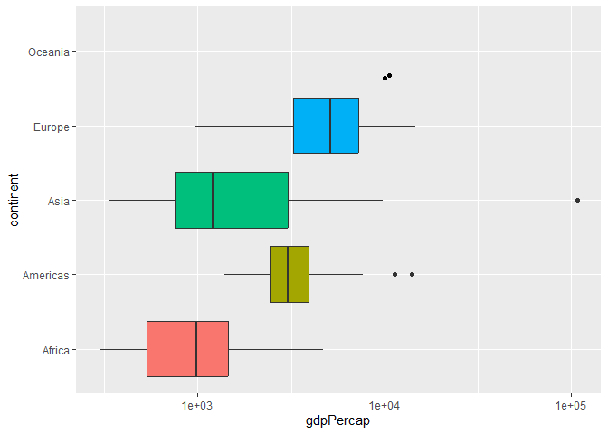
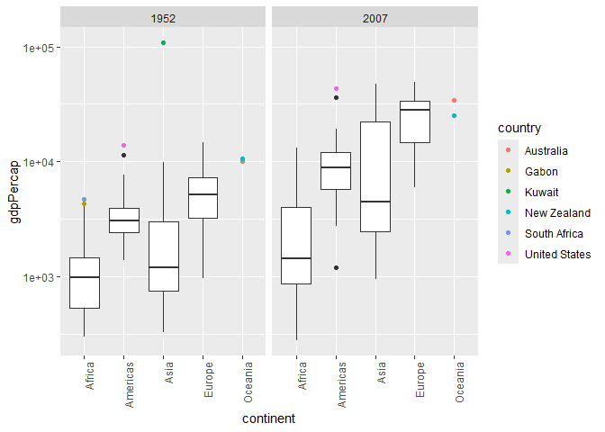
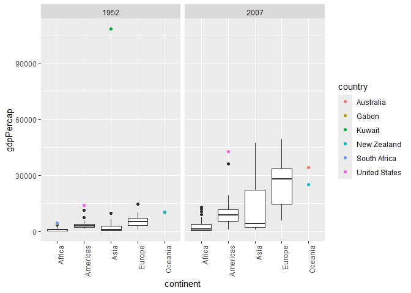
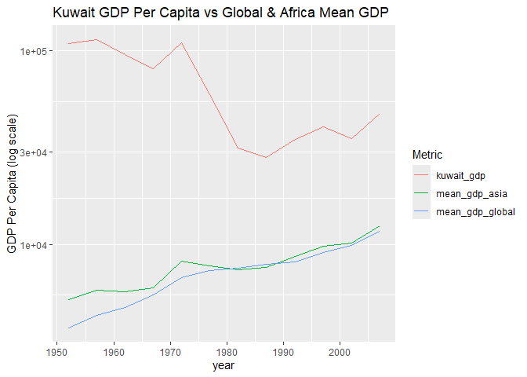
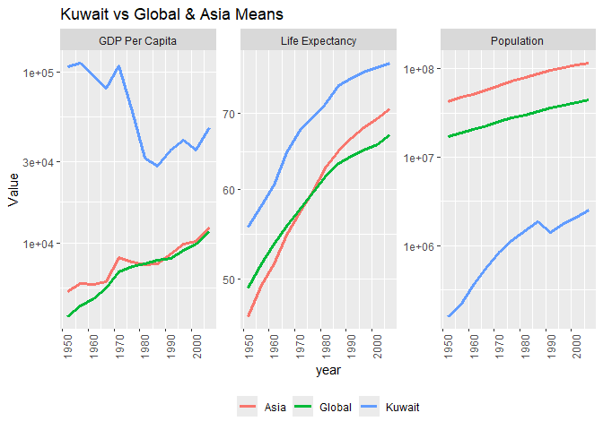
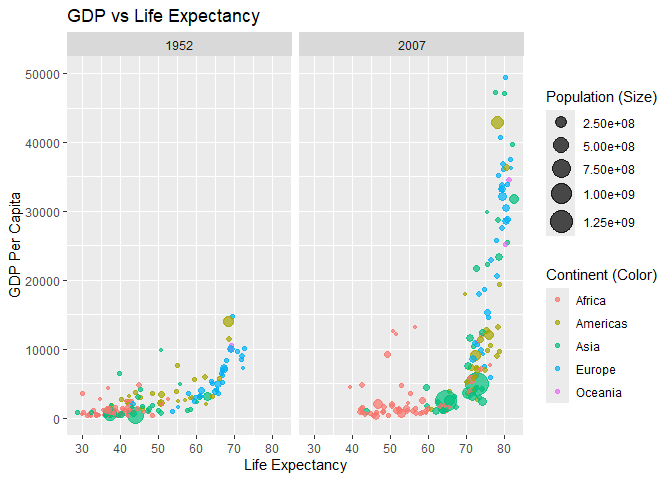
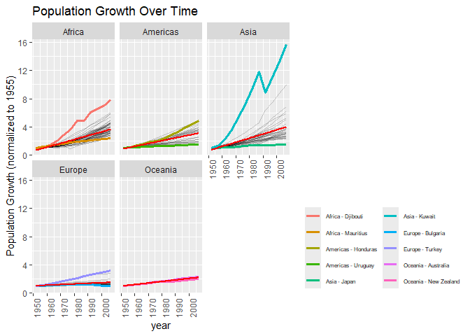

Gapminder
================
Oliver Buchwald
2025-03-02

- [Grading Rubric](#grading-rubric)
  - [Individual](#individual)
  - [Submission](#submission)
- [Guided EDA](#guided-eda)
  - [**q0** Perform your “first checks” on the dataset. What variables
    are in
    this](#q0-perform-your-first-checks-on-the-dataset-what-variables-are-in-this)
  - [**q1** Determine the most and least recent years in the `gapminder`
    dataset.](#q1-determine-the-most-and-least-recent-years-in-the-gapminder-dataset)
  - [**q2** Filter on years matching `year_min`, and make a plot of the
    GDP per capita against continent. Choose an appropriate `geom_` to
    visualize the data. What observations can you
    make?](#q2-filter-on-years-matching-year_min-and-make-a-plot-of-the-gdp-per-capita-against-continent-choose-an-appropriate-geom_-to-visualize-the-data-what-observations-can-you-make)
  - [**q3** You should have found *at least* three outliers in q2 (but
    possibly many more!). Identify those outliers (figure out which
    countries they
    are).](#q3-you-should-have-found-at-least-three-outliers-in-q2-but-possibly-many-more-identify-those-outliers-figure-out-which-countries-they-are)
  - [**q4** Create a plot similar to yours from q2 studying both
    `year_min` and `year_max`. Find a way to highlight the outliers from
    q3 on your plot *in a way that lets you identify which country is
    which*. Compare the patterns between `year_min` and
    `year_max`.](#q4-create-a-plot-similar-to-yours-from-q2-studying-both-year_min-and-year_max-find-a-way-to-highlight-the-outliers-from-q3-on-your-plot-in-a-way-that-lets-you-identify-which-country-is-which-compare-the-patterns-between-year_min-and-year_max)
- [Your Own EDA](#your-own-eda)
  - [**q5** Create *at least* three new figures below. With each figure,
    try to pose new questions about the
    data.](#q5-create-at-least-three-new-figures-below-with-each-figure-try-to-pose-new-questions-about-the-data)

*Purpose*: Learning to do EDA well takes practice! In this challenge
you’ll further practice EDA by first completing a guided exploration,
then by conducting your own investigation. This challenge will also give
you a chance to use the wide variety of visual tools we’ve been
learning.

<!-- include-rubric -->

# Grading Rubric

<!-- -------------------------------------------------- -->

Unlike exercises, **challenges will be graded**. The following rubrics
define how you will be graded, both on an individual and team basis.

## Individual

<!-- ------------------------- -->

| Category | Needs Improvement | Satisfactory |
|----|----|----|
| Effort | Some task **q**’s left unattempted | All task **q**’s attempted |
| Observed | Did not document observations, or observations incorrect | Documented correct observations based on analysis |
| Supported | Some observations not clearly supported by analysis | All observations clearly supported by analysis (table, graph, etc.) |
| Assessed | Observations include claims not supported by the data, or reflect a level of certainty not warranted by the data | Observations are appropriately qualified by the quality & relevance of the data and (in)conclusiveness of the support |
| Specified | Uses the phrase “more data are necessary” without clarification | Any statement that “more data are necessary” specifies which *specific* data are needed to answer what *specific* question |
| Code Styled | Violations of the [style guide](https://style.tidyverse.org/) hinder readability | Code sufficiently close to the [style guide](https://style.tidyverse.org/) |

## Submission

<!-- ------------------------- -->

Make sure to commit both the challenge report (`report.md` file) and
supporting files (`report_files/` folder) when you are done! Then submit
a link to Canvas. **Your Challenge submission is not complete without
all files uploaded to GitHub.**

``` r
library(tidyverse)
```

    ## ── Attaching core tidyverse packages ──────────────────────── tidyverse 2.0.0 ──
    ## ✔ dplyr     1.1.4     ✔ readr     2.1.5
    ## ✔ forcats   1.0.0     ✔ stringr   1.5.1
    ## ✔ ggplot2   3.5.1     ✔ tibble    3.2.1
    ## ✔ lubridate 1.9.4     ✔ tidyr     1.3.1
    ## ✔ purrr     1.0.2     
    ## ── Conflicts ────────────────────────────────────────── tidyverse_conflicts() ──
    ## ✖ dplyr::filter() masks stats::filter()
    ## ✖ dplyr::lag()    masks stats::lag()
    ## ℹ Use the conflicted package (<http://conflicted.r-lib.org/>) to force all conflicts to become errors

``` r
library(gapminder)
```

*Background*: [Gapminder](https://www.gapminder.org/about-gapminder/) is
an independent organization that seeks to educate people about the state
of the world. They seek to counteract the worldview constructed by a
hype-driven media cycle, and promote a “fact-based worldview” by
focusing on data. The dataset we’ll study in this challenge is from
Gapminder.

# Guided EDA

<!-- -------------------------------------------------- -->

First, we’ll go through a round of *guided EDA*. Try to pay attention to
the high-level process we’re going through—after this guided round
you’ll be responsible for doing another cycle of EDA on your own!

### **q0** Perform your “first checks” on the dataset. What variables are in this

dataset?

``` r
## TASK: Do your "first checks" here!
gapminder %>%
  colnames()
```

    ## [1] "country"   "continent" "year"      "lifeExp"   "pop"       "gdpPercap"

``` r
gapminder %>%
  size_sum()
```

    ## [1] "[1,704 × 6]"

**Observations**:

- Write all variable names here
  - country
  - continent
  - year
  - life expectancy
  - population
  - GDP per capita

### **q1** Determine the most and least recent years in the `gapminder` dataset.

*Hint*: Use the `pull()` function to get a vector out of a tibble.
(Rather than the `$` notation of base R.)

``` r
## TASK: Find the largest and smallest values of `year` in `gapminder`

year_max <-
  gapminder %>%
  summarize(year = max(year)) %>%
  pull(year) 
year_min <- 
  gapminder %>%
  summarize(year = min(year)) %>% 
  pull(year) 
```

Use the following test to check your work.

``` r
## NOTE: No need to change this
assertthat::assert_that(year_max %% 7 == 5)
```

    ## [1] TRUE

``` r
assertthat::assert_that(year_max %% 3 == 0)
```

    ## [1] TRUE

``` r
assertthat::assert_that(year_min %% 7 == 6)
```

    ## [1] TRUE

``` r
assertthat::assert_that(year_min %% 3 == 2)
```

    ## [1] TRUE

``` r
if (is_tibble(year_max)) {
  print("year_max is a tibble; try using `pull()` to get a vector")
  assertthat::assert_that(False)
}

print("Nice!")
```

    ## [1] "Nice!"

### **q2** Filter on years matching `year_min`, and make a plot of the GDP per capita against continent. Choose an appropriate `geom_` to visualize the data. What observations can you make?

You may encounter difficulties in visualizing these data; if so document
your challenges and attempt to produce the most informative visual you
can.

``` r
## TASK: Create a visual of gdpPercap vs continent

df_q2 <-
  gapminder  %>%
  filter(year == min(year))

df_q2 %>% 
  ggplot(aes(gdpPercap, continent, fill = continent)) +
  geom_boxplot(
    data = . %>%
      filter(continent != "Oceania")
  ) + geom_jitter(
    data = . %>%
      filter(continent == "Oceania")
  ) +
  scale_x_log10() + 
  theme(legend.position = "none")
```

<!-- -->

**Observations**:

- Africa has he lowest GDP per capita
- Asia has a very large outlier, and the widest range of GDPs
- Oceania has only 2 data points, both of which are quite high compared
  to the glove as a whole
- The Americas are merged into one category in this data set. I’m
  curious if there would be any distinctive split between North & South
  America if they were plotted separately

**Difficulties & Approaches**:

- The extreme outlier with a high GDP in asia, which makes the data
  quite hard to view - I’m using a log scale to correct against this
- I considered a scatter plot instead of the box plot, but there are
  enough data points in this set that it was unclear to see trends.
  Perhaps a sinaplot would help with this, but I didn’t feel it was
  quite worth it at this stage
- The log scale does make comparisons of the amount of variation in each
  continent difficult. It looks like Europe and Africa have an equally
  wide distribution, but my next plot will show this is not the case.

``` r
df_q2 %>% 
  ggplot(aes(gdpPercap, continent, fill = continent)) +
  geom_boxplot() +
  theme(legend.position = "none") +
  xlim(0,15000)
```

    ## Warning: Removed 1 row containing non-finite outside the scale range
    ## (`stat_boxplot()`).

<!-- -->

**Observations**:

- This plot is not complete! I set limits on the x axis so that it
  excludes the very high outlier in Asia, and adjusted it back to a
  regular, non-log scale
- Excluding that datapoint makes it clearer to see the values of
  outliers for other continents. This plot exists primarily to validate
  my filtering on the next question.
- These axes really drive home that Africa has a lower GDP than other
  continents, and emphasizes that there are only a few outliers in Asia
  among an otherwise low GDP
- Europe appears to have a larger standard deviation than other
  countries. While its min-max range is smaller than Asia, it has much
  more variation within that range.

### **q3** You should have found *at least* three outliers in q2 (but possibly many more!). Identify those outliers (figure out which countries they are).

``` r
## TASK: Identify the outliers from q2
outlier_list <-
  df_q2 %>%
    group_by(continent) %>%
      filter(
        gdpPercap < mean(gdpPercap) - 2*sd(gdpPercap)| 
        gdpPercap > mean(gdpPercap) + 2*sd(gdpPercap)
      ) %>%
    select(country, continent, gdpPercap, year) 
  
outlier_list
```

    ## # A tibble: 7 × 4
    ## # Groups:   continent [4]
    ##   country       continent gdpPercap  year
    ##   <fct>         <fct>         <dbl> <int>
    ## 1 Angola        Africa        3521.  1952
    ## 2 Canada        Americas     11367.  1952
    ## 3 Gabon         Africa        4293.  1952
    ## 4 Kuwait        Asia        108382.  1952
    ## 5 South Africa  Africa        4725.  1952
    ## 6 Switzerland   Europe       14734.  1952
    ## 7 United States Americas     13990.  1952

``` r
outlier_list %>%
  pull(country)
```

    ## [1] Angola        Canada        Gabon         Kuwait        South Africa 
    ## [6] Switzerland   United States
    ## 142 Levels: Afghanistan Albania Algeria Angola Argentina Australia ... Zimbabwe

**Observations**:

- Identify the outlier countries from q2
  - First I tried filtering by percentile, I quickly realized that isn’t
    what we need here- it just finds the max and min values of the
    dataset, and switched to using standard deviation to filter out all
    data points which are \>2 std dev from the mean
  - The table above lists 7 countries which could be considered outliers
    based on that metric. This is corroborated by the 2nd boxplot from
    the previous question, which confirms that the GDP listed represents
    the actual outliers in the dataset
    - The countries in question are Angola, Canada, Gabon, Kuwait, South
      Africa, Switzerland, and the United States
  - I would also consider the continent of Oceania to be an outlier in
    this dataset as it only contains two countries. The countries aren’t
    outliers relative to the continent because there’s not enough data
    to say what an outlier is, but they’re both very high relative to
    the entire dataset.

*Hint*: For the next task, it’s helpful to know a ggplot trick we’ll
learn in an upcoming exercise: You can use the `data` argument inside
any `geom_*` to modify the data that will be plotted *by that geom
only*. For instance, you can use this trick to filter a set of points to
label:

``` r
## NOTE: No need to edit, use ideas from this in q4 below
gapminder %>%
  filter(year == max(year)) %>%

  ggplot(aes(continent, lifeExp)) +
  geom_boxplot() +
  geom_point(
    data = . %>% filter(country %in% c("United Kingdom", "Japan", "Zambia")),
    mapping = aes(color = country),
    size = 2
  )
```

<!-- -->

### **q4** Create a plot similar to yours from q2 studying both `year_min` and `year_max`. Find a way to highlight the outliers from q3 on your plot *in a way that lets you identify which country is which*. Compare the patterns between `year_min` and `year_max`.

*Hint*: We’ve learned a lot of different ways to show multiple
variables; think about using different aesthetics or facets.

``` r
## TASK: Create a visual of gdpPercap vs continent

#refilter outlier_list for both year_min and year_max
outlier_list <-
  gapminder %>%
  filter(year == max(year) | year == min(year)) %>%
    group_by(continent, year) %>%
      filter(
        gdpPercap < mean(gdpPercap) - 3*sd(gdpPercap)| 
        gdpPercap > mean(gdpPercap) + 3*sd(gdpPercap)|
        continent == "Oceania"
      ) %>%
    select(country, continent, gdpPercap, year)

#begin by only using year_min from q2
gapminder %>% 
  filter(year == max(year) | year == min(year)) %>%
  ggplot(aes(continent,gdpPercap)) +
  geom_boxplot(
    data = . %>%
      filter(continent != "Oceania")
  ) +
  geom_point(
    data = outlier_list %>%
      group_by(year),
    mapping = aes(color = country)
  ) +
  scale_y_log10() +  
  facet_wrap(~year) +
  theme(axis.text.x = element_text(angle = 90, hjust = 1))
```

<!-- -->

**Observations**:

- There is a substantial amount of change in the 55 year period of this
  data set. I had to adjust my definition of an outlier to a country
  that is within 3 standard deviations of the mean, rather than 2
  because the countries which were outliers changed from year to year.
  This resulted in a plot with too many individual color-coded points to
  be readable.
- On average, across every continent, GDP increased from 1952 to 2007.
  There are some individual countries which are exceptions to this, but
  for the median, 75th percentile, and maximum of each continent there
  is an upward trend. Kuwait is one noteable exception to this trend -
  Its GDP per capita dropped by nearly 50%. Africa, and the Americas
  also had the minimum GDP drop. What happened in Kuwait?
- Most continents developed a less normal distribution in GDPs over the
  length of the dataset. The boxplots became less symmetric across the
  mean, with Asia and Africa developing a negative skew while Europe and
  the Americas skew more positive

``` r
## A second plot removing the log scale

#begin by only using year_min from q2
gapminder %>% 
  filter(year == max(year) | year == min(year)) %>%
  ggplot(aes(continent,gdpPercap)) +
  geom_boxplot(
    data = . %>%
      filter(continent != "Oceania")
  ) +
  geom_point(
    data = outlier_list %>%
      group_by(year),
    mapping = aes(color = country)
  ) + 
  facet_wrap(~year) +
  theme(axis.text.x = element_text(angle = 90, hjust = 1))
```

<!-- -->

# Your Own EDA

<!-- -------------------------------------------------- -->

Now it’s your turn! We just went through guided EDA considering the GDP
per capita at two time points. You can continue looking at outliers,
consider different years, repeat the exercise with `lifeExp`, consider
the relationship between variables, or something else entirely.

### **q5** Create *at least* three new figures below. With each figure, try to pose new questions about the data.

**Question:** What is going on with Kuwait? Is there anything else weird
about its data?

``` r
## TASK: Your first graph

# Compute mean GDP
gdp_means <- gapminder %>%
  group_by(year) %>%
  summarise(
    mean_gdp_global = mean(gdpPercap, na.rm = TRUE),
    mean_gdp_asia = mean(gdpPercap[continent == "Asia"], na.rm = TRUE),
    kuwait_gdp = gdpPercap[country == "Kuwait"]
  ) %>%
  pivot_longer(cols = c(mean_gdp_global, mean_gdp_asia, kuwait_gdp), 
               names_to = "Metric", 
               values_to = "GDP")


#plot agaisnt kuwait
gdp_means %>%
  ggplot(aes(year, GDP, color = Metric)) +
  geom_line() +
  
  ggtitle("Kuwait GDP Per Capita vs Global & Africa Mean GDP") +
  ylab("GDP Per Capita (log scale)") +
  scale_y_log10()
```

<!-- -->

``` r
# compute means of each  parameter for the globe and for asia
metrics_means <- gapminder %>%
  group_by(year) %>%
  summarise(
    mean_gdp_global = mean(gdpPercap, na.rm = TRUE),
    mean_gdp_asia = mean(gdpPercap[continent == "Asia"], na.rm = TRUE),
    kuwait_gdp = gdpPercap[country == "Kuwait"],

    mean_pop_global = mean(pop, na.rm = TRUE),
    mean_pop_asia = mean(pop[continent == "Asia"], na.rm = TRUE),
    kuwait_pop = pop[country == "Kuwait"],

    mean_lifeExp_global = mean(lifeExp, na.rm = TRUE),
    mean_lifeExp_asia = mean(lifeExp[continent == "Asia"], na.rm = TRUE),
    kuwait_lifeExp = lifeExp[country == "Kuwait"]
  ) %>%
  
  #pivot for better plotting
  pivot_longer(cols = c(mean_gdp_global, mean_gdp_asia, kuwait_gdp, 
                        mean_pop_global, mean_pop_asia, kuwait_pop, 
                        mean_lifeExp_global, mean_lifeExp_asia, kuwait_lifeExp), 
               names_to = "Metric", values_to = "Value") %>%
  
  #add location category to color code
  mutate(Location = case_when(
    str_detect(Metric, "kuwait") ~ "Kuwait",
    str_detect(Metric, "asia") ~ "Asia",
    str_detect(Metric, "global") ~ "Global"
  ),
  # add metric label for faceting
  Metric = case_when(
    str_detect(Metric, "gdp") ~ "GDP Per Capita",
    str_detect(Metric, "pop") ~ "Population",
    str_detect(Metric, "lifeExp") ~ "Life Expectancy"
  ))

# Plot all three metrics
  metrics_means %>%
  ggplot(aes(x = year, y = Value, color = Location)) +
  geom_line(linewidth = 1.2) +
  facet_wrap(~Metric, scales = "free_y") + 
  ggtitle("Kuwait vs Global & Asia Means") +
  ylab("Value") +
  scale_y_log10() + 
  theme(
    legend.title = element_blank(), 
    legend.position = "bottom",
    axis.text.x = element_text(angle = 90, hjust = 1)
  )
```

<!-- -->

- Kuwait’s GDP began to drop drastically from 1970 to 1980. In the 90s
  and 2000s it began increasing again. It is still significantly higher
  than the average GDP of both the continent and the globe.
  - This seems to correspond to the 1973 oil crisis, as Kuwait’s economy
    is significantly reliant on oil
- It seems that the mean of GDPs in Asia experiences a slight dip in
  that time period as well - possibly because Kuwait’s GDP is just that
  high, and its crash dragged down the mean of the continent as a whole.
- Kuwait has a generally high life expectancy and generally low
  population, but the turmoil in its GDP did not seem to have an impact
  on either of these values. Population and life expectancy continually
  trended upwards

**Question:** Is there a relationship between GDP, Life Expectancy &
population?

``` r
## TASK: Your second graph
gapminder %>%
  filter(year == year_max | year == year_min) %>%
    ggplot(aes(x = lifeExp, y = gdpPercap, size = pop, color = continent)) +
    geom_point(alpha = 0.7) +
    scale_size(range = c(1,8)) +
    ylim(0,50000) +
    ggtitle(paste("GDP vs Life Expectancy")) +
    facet_wrap(~year) +
    xlab("Life Expectancy") +
    ylab("GDP Per Capita") +
    guides(
        size = guide_legend(title = "Population (Size)"),
        color = guide_legend(title = "Continent (Color)")
      )
```

    ## Warning: Removed 1 row containing missing values or values outside the scale range
    ## (`geom_point()`).

<!-- -->

- Note: the y axis is truncated to exclude Kuwait from the 1952 data so
  that the plots are clearer to read. It has a GDP of 108,000 per
  capita, a life expectancy of 55.5, and a population of 160,000
- Generally speaking, high GDP corresponds to higher life expectancy.
- There is not a strong relationship between population and either GDP
  or life expectancy. It appears that the countries with the highest
  population have a life expectancy that is near the median of the
  dataset. It effectively seems like countries with a low life
  expectancy do not have a large population, but a high life expectancy
  is not a guarantee of high population - likely due to birthrates
- European countries tend to have the highest life expectancy and GDPs,
  while African countries are the lowest.
- The data is more heavily segmented by continent in 2007 and 1952. On a
  global scale, the data from 1952 shows values for countries in each
  continent that are much closer together than 2007.
- Life expectancy overall increased from 1952 to 2007 by around 10
  years.

**Question:** How has population growth happened over time?

``` r
## TASK: Your third graph

#normalize population growth
df_pop_growth <-
  gapminder %>%
  group_by(country) %>%
  mutate(pop_normalized = pop / pop[year == year_min]) %>%
  ungroup %>%
  mutate(legend_label = paste0(continent, " - ", country ))


# plot all countries
df_pop_growth %>% 
  ggplot(aes(year, pop_normalized, group = country)) +
  
  #plot all countries in transparent lines
  geom_line(alpha = 0.2) +
  #geom_jitter(alpha = 0.2) +
  
  #separately plot max and min country on each continent in color
  geom_line( 
    data = . %>%
      filter(year == year_max) %>%
      group_by(continent) %>%
      filter(
        pop_normalized == max(pop_normalized) |
        pop_normalized == min(pop_normalized)
      ) %>%
      select(country) %>%
      group_by(continent) %>%
      inner_join(df_pop_growth, by = c("continent","country")) ,
    aes(color = legend_label),
    linewidth = 1.2
  ) + 
  
  #add smooth trendline for each continent
  geom_smooth(aes(group = continent), color = "red", alpha = 0.5, linewidth = 0.8, method = "lm", se = FALSE) +
  
  ggtitle("Population Growth Over Time") +
  ylab("Population Growth (normalized to 1955)") +
  facet_wrap(~continent) +
  guides(color = guide_legend(ncol = 2)) +
  theme(
    legend.text = element_text(size = 6), 
    legend.title = element_blank(),
    legend.position.inside = c(1.03,0),
    legend.justification = c(1, 0),
    axis.text.x = element_text(angle = 90, hjust = 1)
  )
```

    ## Adding missing grouping variables: `continent`
    ## `geom_smooth()` using formula = 'y ~ x'

<!-- -->

- For these plots, I normalized the population growth by dividing
  population of each country by its population in 1955. This makes it
  much clearer to compare growth without a few high-population outliers
  compressing the axes excessively.
- Asia and africa have the greatest proportion of population growth rate
  of any continent
- Interestingly, Kuwait has the highest rate of population increase per
  capita, despite its low population. This is a noteable limitation of
  this plot that it doesn’t consider actual population size, only growth
  rates. Djibouti and another country in Asia are other noteably
  high-growth countries, with the population growing 8x in this 55year
  period
- Europe and Oceania both experience very low growth in population, with
  a growth rate of ~1.5x and 2x respectively. Bulgaria is the country
  with the lowest population growth of all, at a rate of \<1% growth
  over the entire dataset.
