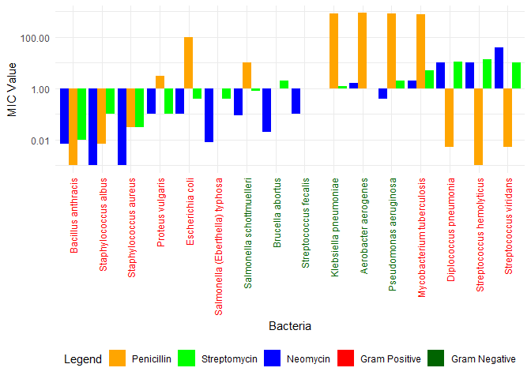
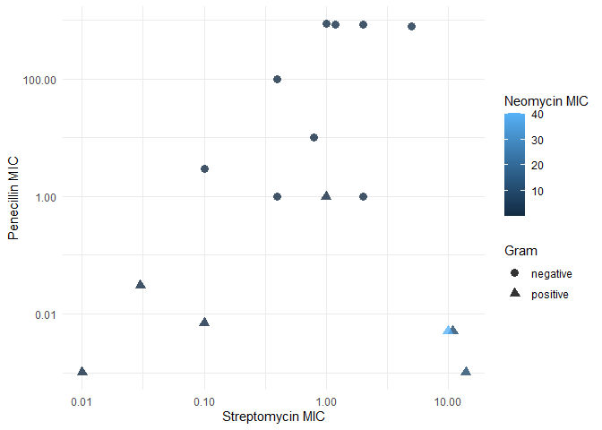
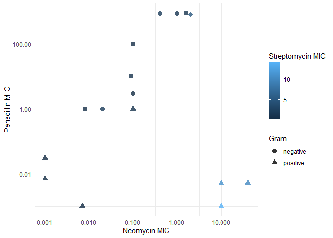
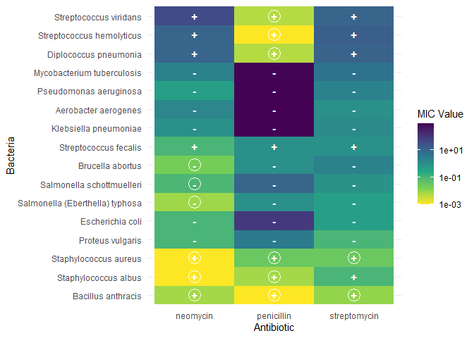

Antibiotics
================
Oliver Buchwald
2025-03-09

*Purpose*: Creating effective data visualizations is an *iterative*
process; very rarely will the first graph you make be the most
effective. The most effective thing you can do to be successful in this
iterative process is to *try multiple graphs* of the same data.

Furthermore, judging the effectiveness of a visual is completely
dependent on *the question you are trying to answer*. A visual that is
totally ineffective for one question may be perfect for answering a
different question.

In this challenge, you will practice *iterating* on data visualization,
and will anchor the *assessment* of your visuals using two different
questions.

*Note*: Please complete your initial visual design **alone**. Work on
both of your graphs alone, and save a version to your repo *before*
coming together with your team. This way you can all bring a diversity
of ideas to the table!

<!-- include-rubric -->

# Grading Rubric

<!-- -------------------------------------------------- -->

Unlike exercises, **challenges will be graded**. The following rubrics
define how you will be graded, both on an individual and team basis.

## Individual

<!-- ------------------------- -->

| Category | Needs Improvement | Satisfactory |
|----|----|----|
| Effort | Some task **q**’s left unattempted | All task **q**’s attempted |
| Observed | Did not document observations, or observations incorrect | Documented correct observations based on analysis |
| Supported | Some observations not clearly supported by analysis | All observations clearly supported by analysis (table, graph, etc.) |
| Assessed | Observations include claims not supported by the data, or reflect a level of certainty not warranted by the data | Observations are appropriately qualified by the quality & relevance of the data and (in)conclusiveness of the support |
| Specified | Uses the phrase “more data are necessary” without clarification | Any statement that “more data are necessary” specifies which *specific* data are needed to answer what *specific* question |
| Code Styled | Violations of the [style guide](https://style.tidyverse.org/) hinder readability | Code sufficiently close to the [style guide](https://style.tidyverse.org/) |

## Submission

<!-- ------------------------- -->

Make sure to commit both the challenge report (`report.md` file) and
supporting files (`report_files/` folder) when you are done! Then submit
a link to Canvas. **Your Challenge submission is not complete without
all files uploaded to GitHub.**

``` r
library(tidyverse)
```

    ## ── Attaching core tidyverse packages ──────────────────────── tidyverse 2.0.0 ──
    ## ✔ dplyr     1.1.4     ✔ readr     2.1.5
    ## ✔ forcats   1.0.0     ✔ stringr   1.5.1
    ## ✔ ggplot2   3.5.1     ✔ tibble    3.2.1
    ## ✔ lubridate 1.9.4     ✔ tidyr     1.3.1
    ## ✔ purrr     1.0.4     
    ## ── Conflicts ────────────────────────────────────────── tidyverse_conflicts() ──
    ## ✖ dplyr::filter() masks stats::filter()
    ## ✖ dplyr::lag()    masks stats::lag()
    ## ℹ Use the conflicted package (<http://conflicted.r-lib.org/>) to force all conflicts to become errors

``` r
library(ggrepel)
```

*Background*: The data\[1\] we study in this challenge report the
[*minimum inhibitory
concentration*](https://en.wikipedia.org/wiki/Minimum_inhibitory_concentration)
(MIC) of three drugs for different bacteria. The smaller the MIC for a
given drug and bacteria pair, the more practical the drug is for
treating that particular bacteria. An MIC value of *at most* 0.1 is
considered necessary for treating human patients.

These data report MIC values for three antibiotics—penicillin,
streptomycin, and neomycin—on 16 bacteria. Bacteria are categorized into
a genus based on a number of features, including their resistance to
antibiotics.

``` r
## NOTE: If you extracted all challenges to the same location,
## you shouldn't have to change this filename
filename <- "./data/antibiotics.csv"

## Load the data
df_antibiotics <- read_csv(filename)
```

    ## Rows: 16 Columns: 5
    ## ── Column specification ────────────────────────────────────────────────────────
    ## Delimiter: ","
    ## chr (2): bacteria, gram
    ## dbl (3): penicillin, streptomycin, neomycin
    ## 
    ## ℹ Use `spec()` to retrieve the full column specification for this data.
    ## ℹ Specify the column types or set `show_col_types = FALSE` to quiet this message.

``` r
df_antibiotics %>% knitr::kable()
```

| bacteria                        | penicillin | streptomycin | neomycin | gram     |
|:--------------------------------|-----------:|-------------:|---------:|:---------|
| Aerobacter aerogenes            |    870.000 |         1.00 |    1.600 | negative |
| Brucella abortus                |      1.000 |         2.00 |    0.020 | negative |
| Bacillus anthracis              |      0.001 |         0.01 |    0.007 | positive |
| Diplococcus pneumonia           |      0.005 |        11.00 |   10.000 | positive |
| Escherichia coli                |    100.000 |         0.40 |    0.100 | negative |
| Klebsiella pneumoniae           |    850.000 |         1.20 |    1.000 | negative |
| Mycobacterium tuberculosis      |    800.000 |         5.00 |    2.000 | negative |
| Proteus vulgaris                |      3.000 |         0.10 |    0.100 | negative |
| Pseudomonas aeruginosa          |    850.000 |         2.00 |    0.400 | negative |
| Salmonella (Eberthella) typhosa |      1.000 |         0.40 |    0.008 | negative |
| Salmonella schottmuelleri       |     10.000 |         0.80 |    0.090 | negative |
| Staphylococcus albus            |      0.007 |         0.10 |    0.001 | positive |
| Staphylococcus aureus           |      0.030 |         0.03 |    0.001 | positive |
| Streptococcus fecalis           |      1.000 |         1.00 |    0.100 | positive |
| Streptococcus hemolyticus       |      0.001 |        14.00 |   10.000 | positive |
| Streptococcus viridans          |      0.005 |        10.00 |   40.000 | positive |

``` r
df_antibiotics_longer <-
  df_antibiotics %>% 
  pivot_longer(
    names_to = "antibiotic",
    values_to = "mic",
    cols = penicillin:neomycin
  ) %>%
  mutate(mic_range = ifelse((mic < 20), "Low", "High")) %>%
  mutate(mic_range = factor(mic_range, levels = c("Low", "High"))) %>%
  mutate(bacteria = fct_reorder(bacteria, mic));

df_antibiotics_longer
```

    ## # A tibble: 48 × 5
    ##    bacteria              gram     antibiotic       mic mic_range
    ##    <fct>                 <chr>    <chr>          <dbl> <fct>    
    ##  1 Aerobacter aerogenes  negative penicillin   870     High     
    ##  2 Aerobacter aerogenes  negative streptomycin   1     Low      
    ##  3 Aerobacter aerogenes  negative neomycin       1.6   Low      
    ##  4 Brucella abortus      negative penicillin     1     Low      
    ##  5 Brucella abortus      negative streptomycin   2     Low      
    ##  6 Brucella abortus      negative neomycin       0.02  Low      
    ##  7 Bacillus anthracis    positive penicillin     0.001 Low      
    ##  8 Bacillus anthracis    positive streptomycin   0.01  Low      
    ##  9 Bacillus anthracis    positive neomycin       0.007 Low      
    ## 10 Diplococcus pneumonia positive penicillin     0.005 Low      
    ## # ℹ 38 more rows

# Visualization

<!-- -------------------------------------------------- -->

### **q1** Prototype 5 visuals

To start, construct **5 qualitatively different visualizations of the
data** `df_antibiotics`. These **cannot** be simple variations on the
same graph; for instance, if two of your visuals could be made identical
by calling `coord_flip()`, then these are *not* qualitatively different.

For all five of the visuals, you must show information on *all 16
bacteria*. For the first two visuals, you must *show all variables*.

*Hint 1*: Try working quickly on this part; come up with a bunch of
ideas, and don’t fixate on any one idea for too long. You will have a
chance to refine later in this challenge.

*Hint 2*: The data `df_antibiotics` are in a *wide* format; it may be
helpful to `pivot_longer()` the data to make certain visuals easier to
construct.

#### Visual 1 (All variables)

In this visual you must show *all three* effectiveness values for *all
16 bacteria*. This means **it must be possible to identify each of the
16 bacteria by name.** You must also show whether or not each bacterium
is Gram positive or negative.

``` r
# bars for effectiveness of each bacteria
# this graph is a mess and i'm sorry, i spent so long trying to make it good but eventaully gave up and moved on

df_antibiotics_longer %>%
  ggplot(aes(x = bacteria, y = mic, fill = antibiotic)) +
  geom_col(position = "dodge") +
  #dummy data for legend
  geom_rect(aes(fill = gram), xmin = -1, xmax = 0, ymin = -1, ymax = 0) +
  
  # #remake defualt legend
  # scale_fill_manual(
  #   values = c("penicillin" = "orange", 
  #              "streptomycin" = "green", 
  #              "neomycin" = "blue"),
  #   name = "Antibiotic", 
  #   guide = guide_legend(order = 1)# Bar legend title
  # ) +
  # 
  # #text color legend
  # scale_color_manual(
  #   values = c("positive" = "red", "negative" = "#006400"),
  #   name = "Gram",
  #   labels = c("Positive", "Negative"),
  #   guide = guide_legend(override.aes =  list(color = NA),
  #                        order = 2)
  #   ) + 
  
  #legend final attempt
  scale_fill_manual(
    values = c("penicillin" = "orange", 
               "streptomycin" = "green", 
               "neomycin" = "blue",
               "positive" = "red",      
               "negative" = "#006400"), 
    name = "Legend",
    breaks = c("penicillin", "streptomycin", "neomycin", "positive", "negative"),
    labels = c("Penicillin", "Streptomycin", "Neomycin", "Gram Positive", "Gram Negative")
  ) +
  scale_y_log10(labels = scales::label_number(scale_cut = scales::cut_short_scale())) +
  labs(
    x = "Bacteria",
    y = "MIC Value",
    fill = "Antibiotic",
    color = "Gram"
  ) + 
  
  
  theme_minimal() +
  theme(
    axis.text.x = element_text(angle = 90, 
                               vjust = 0.5, 
                               hjust = 1,
                               colour = ifelse(df_antibiotics_longer$gram == "negative", "red", "#006400")),
    legend.position = "bottom"
  )
```

    ## Warning: Vectorized input to `element_text()` is not officially supported.
    ## ℹ Results may be unexpected or may change in future versions of ggplot2.

<!-- -->

#### Visual 2 (All variables)

In this visual you must show *all three* effectiveness values for *all
16 bacteria*. This means **it must be possible to identify each of the
16 bacteria by name.** You must also show whether or not each bacterium
is Gram positive or negative.

Note that your visual must be *qualitatively different* from *all* of
your other visuals.

``` r
#dotplot on log scales to simplify v01 mess

df_antibiotics_longer %>% 
  ggplot(aes(x = mic, y = bacteria, color = antibiotic)) +
  #reference for effectiveness <0.1
  geom_vline(xintercept = 0.1, linetype = "dashed", color = "gray") +
  #plot data
  geom_point(aes(shape = gram), alpha = 0.85, size = 2.5) +
  scale_x_log10() +
  labs(
    x = "MIC Value (log)",
    y = "Bacteria",
    color = "Antibiotic",
    shape = "Gram"
  ) + 
  theme_minimal()
```

<!-- -->

#### Visual 3 (Some variables)

In this visual you may show a *subset* of the variables (`penicillin`,
`streptomycin`, `neomycin`, `gram`), but you must still show *all 16
bacteria*.

Note that your visual must be *qualitatively different* from *all* of
your other visuals.

``` r
# comparing effectiveness of varios antibioitcs

df_antibiotics %>%
  ggplot(aes(x = neomycin, y = streptomycin, color = penicillin)) +
  geom_point(aes(shape = gram), size = 3, alpha = 0.8) +
  labs(
    x = "Neomycin MIC",
    y = "Streptomycin MIC",
    color = "Penecillin MIC",
    shape = "Gram"
  ) +
  scale_y_log10(labels = scales::label_number(scale_cut = scales::cut_short_scale())) +
  scale_x_log10(labels = scales::label_number(scale_cut = scales::cut_short_scale())) +
  #facet_wrap(~gram) +
  theme_minimal()
```

<!-- -->

``` r
df_antibiotics %>%
  ggplot(aes(color = neomycin, y = penicillin, x = streptomycin)) +
  geom_point(aes(shape = gram), size = 3, alpha = 0.8) +
   labs(
    color = "Neomycin MIC",
    x= "Streptomycin MIC",
    y = "Penecillin MIC",
    shape = "Gram"
  ) +
  scale_y_log10(labels = scales::label_number(scale_cut = scales::cut_short_scale())) +
  scale_x_log10(labels = scales::label_number(scale_cut = scales::cut_short_scale())) +
  # facet_wrap(~gram) +
  theme_minimal()
```

<!-- -->

``` r
df_antibiotics %>%
  ggplot(aes(x = neomycin, y = penicillin, color = streptomycin)) +
  geom_point(aes(shape = gram), size = 3, alpha = 0.8) +
  labs(
    x = "Neomycin MIC",
    color= "Streptomycin MIC",
    y = "Penecillin MIC",
    shape = "Gram"
  ) +
  scale_y_log10(labels = scales::label_number(scale_cut = scales::cut_short_scale())) +
  scale_x_log10(labels = scales::label_number(scale_cut = scales::cut_short_scale())) +
  theme_minimal()
```

<!-- -->

#### Visual 4 (Some variables)

In this visual you may show a *subset* of the variables (`penicillin`,
`streptomycin`, `neomycin`, `gram`), but you must still show *all 16
bacteria*.

Note that your visual must be *qualitatively different* from *all* of
your other visuals.

``` r
# color table
df_antibiotics_longer %>%
  ggplot(aes(antibiotic, bacteria)) +
  geom_tile(mapping = aes(fill = mic)) +
  scale_fill_viridis_c(trans = "log10",
                       direction = -1) +
  #add flag if drug is effective
  geom_point(data = . %>% filter(mic<0.1),
             aes(x = antibiotic, y = bacteria),
             shape = 1,
             size = 6,
             color = "white") +
  #add sign for pos or negative
  geom_text(aes(label = ifelse(gram == "positive", "+", "-")), 
            fontface = "bold", 
            color = "white") +

  
  labs(x = "Antibiotic",
       y = "Bacteria",
       fill = "MIC Value"
  ) +
  theme_minimal()
```

<!-- -->

#### Visual 5 (Some variables)

In this visual you may show a *subset* of the variables (`penicillin`,
`streptomycin`, `neomycin`, `gram`), but you must still show *all 16
bacteria*.

Note that your visual must be *qualitatively different* from *all* of
your other visuals.

``` r
df_antibiotic_eff <-
  df_antibiotics_longer %>%
  mutate(effective = ifelse(mic <= 0.1, "yes", "no"))

df_antibiotic_eff
```

    ## # A tibble: 48 × 6
    ##    bacteria              gram     antibiotic       mic mic_range effective
    ##    <fct>                 <chr>    <chr>          <dbl> <fct>     <chr>    
    ##  1 Aerobacter aerogenes  negative penicillin   870     High      no       
    ##  2 Aerobacter aerogenes  negative streptomycin   1     Low       no       
    ##  3 Aerobacter aerogenes  negative neomycin       1.6   Low       no       
    ##  4 Brucella abortus      negative penicillin     1     Low       no       
    ##  5 Brucella abortus      negative streptomycin   2     Low       no       
    ##  6 Brucella abortus      negative neomycin       0.02  Low       yes      
    ##  7 Bacillus anthracis    positive penicillin     0.001 Low       yes      
    ##  8 Bacillus anthracis    positive streptomycin   0.01  Low       yes      
    ##  9 Bacillus anthracis    positive neomycin       0.007 Low       yes      
    ## 10 Diplococcus pneumonia positive penicillin     0.005 Low       yes      
    ## # ℹ 38 more rows

``` r
df_antibiotic_eff %>%
  ggplot(aes(x = antibiotic, y = mic)) +
  geom_boxplot(aes(fill = gram)) +
  geom_point(aes(fill = gram),
             position = position_jitterdodge(jitter.width = 0, dodge.width = 0.75)) +
  scale_y_log10() +
  geom_hline(yintercept = 0.1, linetype = "dashed", color = "gray") +
  theme_minimal()
```

<!-- -->

### **q2** Assess your visuals

There are **two questions** below; use your five visuals to help answer
both Guiding Questions. Note that you must also identify which of your
five visuals were most helpful in answering the questions.

*Hint 1*: It’s possible that *none* of your visuals is effective in
answering the questions below. You may need to revise one or more of
your visuals to answer the questions below!

*Hint 2*: It’s **highly unlikely** that the same visual is the most
effective at helping answer both guiding questions. **Use this as an
opportunity to think about why this is.**

#### Guiding Question 1

> How do the three antibiotics vary in their effectiveness against
> bacteria of different genera and Gram stain?

*Observations* -

- What is your response to the question above?

  - No one antibioitc is effective against all bacteria. In fact, only
    one bacteria can be treated by more than one antibiotic, using the
    requirement of a MIC value that is \<0.1

  - These antibiotics are more effective at treating gram positive
    bacteria than gram negative. Far more negative bacteria have no
    antibiotic in this dataset that is effective against them

  - Streptomycin is the least effective of the antibiotics, as far as
    number of bacteria it is effective against.

    - However, it is more effective than penicillin at treating some
      bacteria. It isn’t always the least effective on every bacteria,
      it just doesn’t ever meet the 0.1 threshhold

  - Effectiveness of penicillin varies wildly from bacteria to bacteria.
    It is able to treat some diseases well, but for others its MIC value
    is an order of magnitude higher than other antibiotics, even
    streptomycin

- Which of your visuals above (1 through 5) is **most effective** at
  helping to answer this question?

  - I find my figure 4 (the geom_tile heatmap of color tones) to be most
    effective.

  - The boxplot (figure 5) is also helpful

- Why?

  - It is effectively a color-coded table of the raw data. The + and -
    signs, as well as the circle indicating whether the MIC value is
    below the 0.1 cutoff make it super clear to answer a specific
    question. This is in contrast to, in my opinion, all of the bar and
    scatter plots where the data doesn’t follow a clear enough trend as
    to be helpful.

  - The boxplot offers a slightly more visual rendition of the same
    data, and is in my opinion clearer to an audience

#### Guiding Question 2

In 1974 *Diplococcus pneumoniae* was renamed *Streptococcus pneumoniae*,
and in 1984 *Streptococcus fecalis* was renamed *Enterococcus fecalis*
\[2\].

> Why was *Diplococcus pneumoniae* was renamed *Streptococcus
> pneumoniae*?

*Observations* -

- What is your response to the question above?

  - It responds to all three antibiotics in a way that is near identical
    to Streptococcus hemolyticus and to an extent, similar to
    Streptococcus viridans. It does not match Streptococcus fecalis, but
    that makes sense since it was also reclassified

  - All three streptococcus bacteria are gram positive

- Which of your visuals above (1 through 5) is **most effective** at
  helping to answer this question?

  - Figure 2 was easiest here for a concrete comparison, but I started
    out at fig 4 to get an idea of what to look for.

- Why?

  - Figure 2 shows much more easy-to-compare data than fig 4. It has
    common axes for all bacteria, which makes it easy to spot just how
    much they match.

# References

<!-- -------------------------------------------------- -->

\[1\] Neomycin in skin infections: A new topical antibiotic with wide
antibacterial range and rarely sensitizing. Scope. 1951;3(5):4-7.

\[2\] Wainer and Lysen, “That’s Funny…” *American Scientist* (2009)
[link](https://www.americanscientist.org/article/thats-funny)
