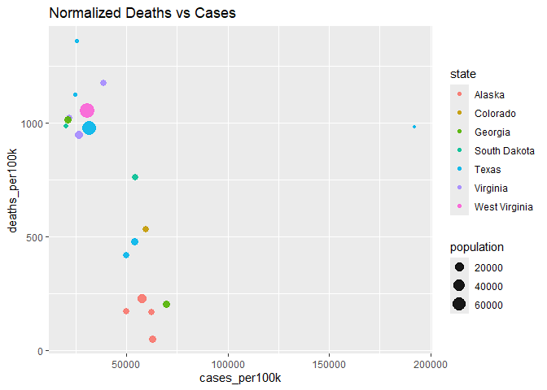
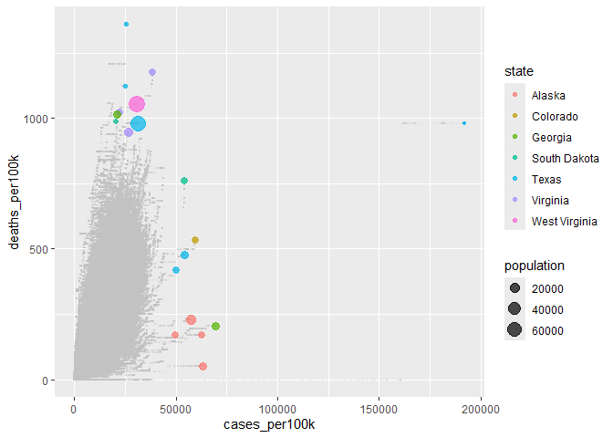
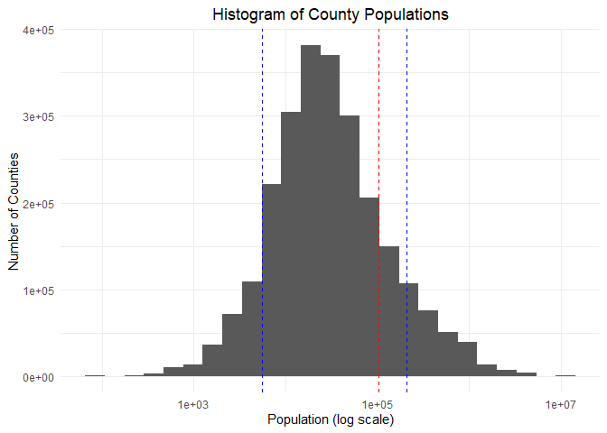
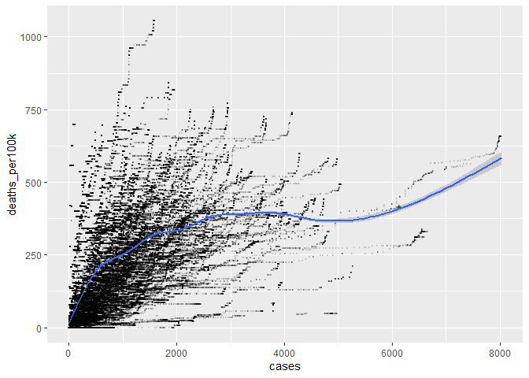
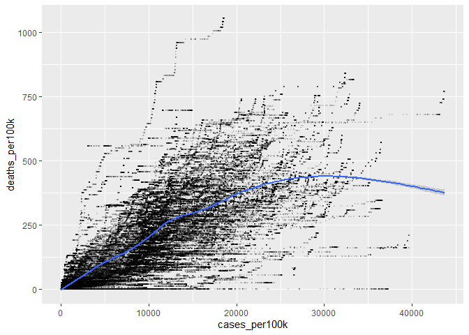
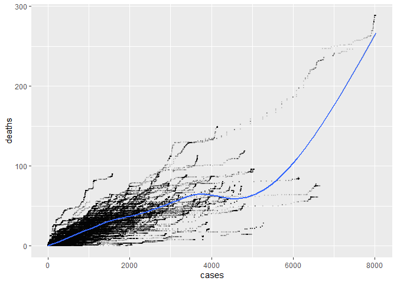
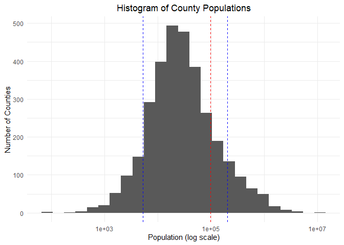
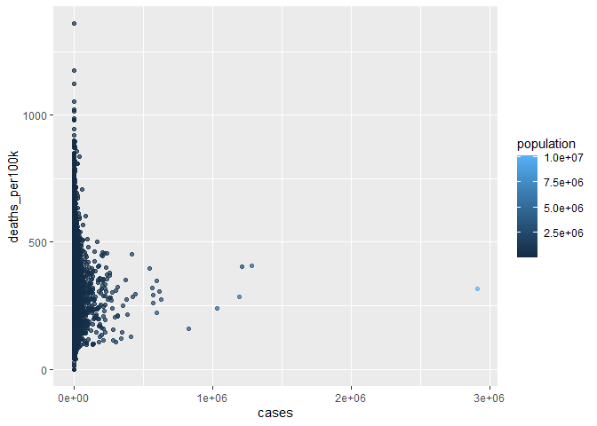
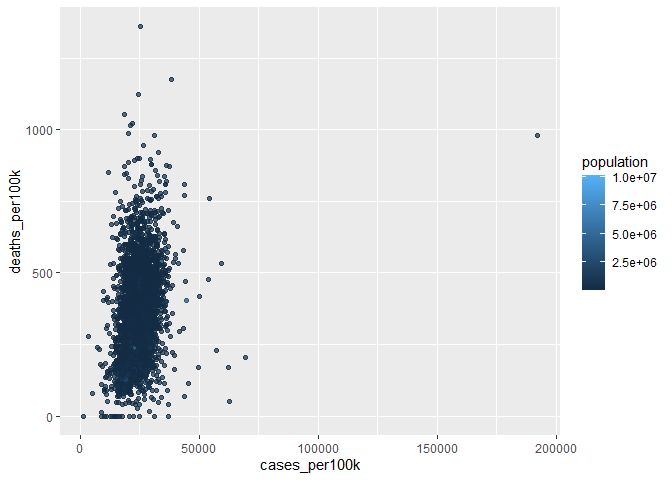
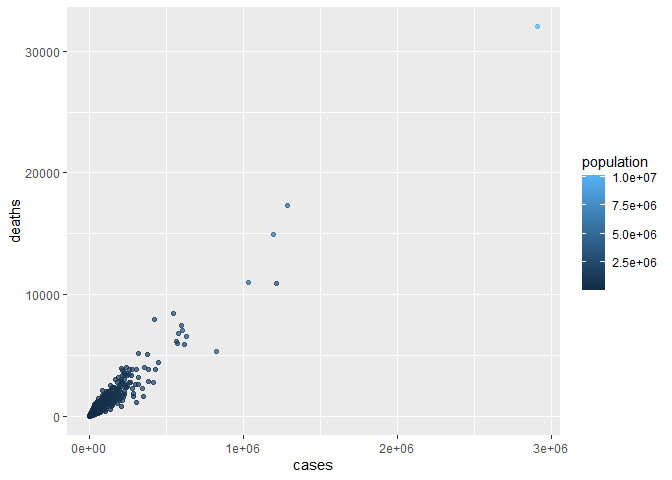

COVID-19
================
Oliver Buchwald
2025-03-08

- [Grading Rubric](#grading-rubric)
  - [Individual](#individual)
  - [Submission](#submission)
- [The Big Picture](#the-big-picture)
- [Get the Data](#get-the-data)
  - [Navigating the Census Bureau](#navigating-the-census-bureau)
    - [**q1** Load Table `B01003` into the following tibble. Make sure
      the column names are
      `id, Geographic Area Name, Estimate!!Total, Margin of Error!!Total`.](#q1-load-table-b01003-into-the-following-tibble-make-sure-the-column-names-are-id-geographic-area-name-estimatetotal-margin-of-errortotal)
  - [Automated Download of NYT Data](#automated-download-of-nyt-data)
    - [**q2** Visit the NYT GitHub repo and find the URL for the **raw**
      US County-level data. Assign that URL as a string to the variable
      below.](#q2-visit-the-nyt-github-repo-and-find-the-url-for-the-raw-us-county-level-data-assign-that-url-as-a-string-to-the-variable-below)
- [Join the Data](#join-the-data)
  - [**q3** Process the `id` column of `df_pop` to create a `fips`
    column.](#q3-process-the-id-column-of-df_pop-to-create-a-fips-column)
  - [**q4** Join `df_covid` with `df_q3` by the `fips` column. Use the
    proper type of join to preserve *only* the rows in
    `df_covid`.](#q4-join-df_covid-with-df_q3-by-the-fips-column-use-the-proper-type-of-join-to-preserve-only-the-rows-in-df_covid)
- [Analyze](#analyze)
  - [Normalize](#normalize)
    - [**q5** Use the `population` estimates in `df_data` to normalize
      `cases` and `deaths` to produce per 100,000 counts \[3\]. Store
      these values in the columns `cases_per100k` and
      `deaths_per100k`.](#q5-use-the-population-estimates-in-df_data-to-normalize-cases-and-deaths-to-produce-per-100000-counts-3-store-these-values-in-the-columns-cases_per100k-and-deaths_per100k)
  - [Guided EDA](#guided-eda)
    - [**q6** Compute some summaries](#q6-compute-some-summaries)
    - [**q7** Find and compare the top
      10](#q7-find-and-compare-the-top-10)
  - [Self-directed EDA](#self-directed-eda)
    - [**q8** Drive your own ship: You’ve just put together a very rich
      dataset; you now get to explore! Pick your own direction and
      generate at least one punchline figure to document an interesting
      finding. I give a couple tips & ideas
      below:](#q8-drive-your-own-ship-youve-just-put-together-a-very-rich-dataset-you-now-get-to-explore-pick-your-own-direction-and-generate-at-least-one-punchline-figure-to-document-an-interesting-finding-i-give-a-couple-tips--ideas-below)
    - [Ideas](#ideas)
    - [Aside: Some visualization
      tricks](#aside-some-visualization-tricks)
    - [Geographic exceptions](#geographic-exceptions)
- [Notes](#notes)

*Purpose*: In this challenge, you’ll learn how to navigate the U.S.
Census Bureau website, programmatically download data from the internet,
and perform a county-level population-weighted analysis of current
COVID-19 trends. This will give you the base for a very deep
investigation of COVID-19, which we’ll build upon for Project 1.

<!-- include-rubric -->

# Grading Rubric

<!-- -------------------------------------------------- -->

Unlike exercises, **challenges will be graded**. The following rubrics
define how you will be graded, both on an individual and team basis.

## Individual

<!-- ------------------------- -->

| Category | Needs Improvement | Satisfactory |
|----|----|----|
| Effort | Some task **q**’s left unattempted | All task **q**’s attempted |
| Observed | Did not document observations, or observations incorrect | Documented correct observations based on analysis |
| Supported | Some observations not clearly supported by analysis | All observations clearly supported by analysis (table, graph, etc.) |
| Assessed | Observations include claims not supported by the data, or reflect a level of certainty not warranted by the data | Observations are appropriately qualified by the quality & relevance of the data and (in)conclusiveness of the support |
| Specified | Uses the phrase “more data are necessary” without clarification | Any statement that “more data are necessary” specifies which *specific* data are needed to answer what *specific* question |
| Code Styled | Violations of the [style guide](https://style.tidyverse.org/) hinder readability | Code sufficiently close to the [style guide](https://style.tidyverse.org/) |

## Submission

<!-- ------------------------- -->

Make sure to commit both the challenge report (`report.md` file) and
supporting files (`report_files/` folder) when you are done! Then submit
a link to Canvas. **Your Challenge submission is not complete without
all files uploaded to GitHub.**

``` r
library(tidyverse)
```

    ## ── Attaching core tidyverse packages ──────────────────────── tidyverse 2.0.0 ──
    ## ✔ dplyr     1.1.4     ✔ readr     2.1.5
    ## ✔ forcats   1.0.0     ✔ stringr   1.5.1
    ## ✔ ggplot2   3.5.1     ✔ tibble    3.2.1
    ## ✔ lubridate 1.9.4     ✔ tidyr     1.3.1
    ## ✔ purrr     1.0.4     
    ## ── Conflicts ────────────────────────────────────────── tidyverse_conflicts() ──
    ## ✖ dplyr::filter() masks stats::filter()
    ## ✖ dplyr::lag()    masks stats::lag()
    ## ℹ Use the conflicted package (<http://conflicted.r-lib.org/>) to force all conflicts to become errors

*Background*:
[COVID-19](https://en.wikipedia.org/wiki/Coronavirus_disease_2019) is
the disease caused by the virus SARS-CoV-2. In 2020 it became a global
pandemic, leading to huge loss of life and tremendous disruption to
society. The New York Times (as of writing) publishes up-to-date data on
the progression of the pandemic across the United States—we will study
these data in this challenge.

*Optional Readings*: I’ve found this [ProPublica
piece](https://www.propublica.org/article/how-to-understand-covid-19-numbers)
on “How to understand COVID-19 numbers” to be very informative!

# The Big Picture

<!-- -------------------------------------------------- -->

We’re about to go through *a lot* of weird steps, so let’s first fix the
big picture firmly in mind:

We want to study COVID-19 in terms of data: both case counts (number of
infections) and deaths. We’re going to do a county-level analysis in
order to get a high-resolution view of the pandemic. Since US counties
can vary widely in terms of their population, we’ll need population
estimates in order to compute infection rates (think back to the
`Titanic` challenge).

That’s the high-level view; now let’s dig into the details.

# Get the Data

<!-- -------------------------------------------------- -->

1.  County-level population estimates (Census Bureau)
2.  County-level COVID-19 counts (New York Times)

## Navigating the Census Bureau

<!-- ------------------------- -->

**Steps**: Our objective is to find the 2018 American Community
Survey\[1\] (ACS) Total Population estimates, disaggregated by counties.
To check your results, this is Table `B01003`.

1.  Go to [data.census.gov](data.census.gov).
2.  Scroll down and click `View Tables`.
3.  Apply filters to find the ACS **Total Population** estimates,
    disaggregated by counties. I used the filters:

- `Topics > Populations and People > Counts, Estimates, and Projections > Population Total`
- `Geography > County > All counties in United States`

5.  Select the **Total Population** table and click the `Download`
    button to download the data; make sure to select the 2018 5-year
    estimates.
6.  Unzip and move the data to your `challenges/data` folder.

- Note that the data will have a crazy-long filename like
  `ACSDT5Y2018.B01003_data_with_overlays_2020-07-26T094857.csv`. That’s
  because metadata is stored in the filename, such as the year of the
  estimate (`Y2018`) and my access date (`2020-07-26`). **Your filename
  will vary based on when you download the data**, so make sure to copy
  the filename that corresponds to what you downloaded!

### **q1** Load Table `B01003` into the following tibble. Make sure the column names are `id, Geographic Area Name, Estimate!!Total, Margin of Error!!Total`.

*Hint*: You will need to use the `skip` keyword when loading these data!

``` r
## TASK: Load the census bureau data with the following tibble name.


pop <- "./data/ACSDT5Y2018.B01003-Data.csv"
pop_columns <- "./data/ACSDT5Y2018.B01003-Column-Metadata.csv"

df_pop <- read_csv(pop, skip = 2, 
                    na = "*****", 
                    col_types = "ccd_d__", 
                    col_names = c("id", 
                                  "Geographic Area Name", 
                                  "Estimate!!Total", 
                                  "Margin of Error!!Total"))
```

    ## Warning: One or more parsing issues, call `problems()` on your data frame for details,
    ## e.g.:
    ##   dat <- vroom(...)
    ##   problems(dat)

``` r
head(df_pop)
```

    ## # A tibble: 6 × 4
    ##   id             `Geographic Area Name` `Estimate!!Total` Margin of Error!!Tot…¹
    ##   <chr>          <chr>                              <dbl>                  <dbl>
    ## 1 0500000US01001 Autauga County, Alaba…             55200                     NA
    ## 2 0500000US01003 Baldwin County, Alaba…            208107                     NA
    ## 3 0500000US01005 Barbour County, Alaba…             25782                     NA
    ## 4 0500000US01007 Bibb County, Alabama               22527                     NA
    ## 5 0500000US01009 Blount County, Alabama             57645                     NA
    ## 6 0500000US01011 Bullock County, Alaba…             10352                     NA
    ## # ℹ abbreviated name: ¹​`Margin of Error!!Total`

*Note*: You can find information on 1-year, 3-year, and 5-year estimates
[here](https://www.census.gov/programs-surveys/acs/guidance/estimates.html).
The punchline is that 5-year estimates are more reliable but less
current.

## Automated Download of NYT Data

<!-- ------------------------- -->

ACS 5-year estimates don’t change all that often, but the COVID-19 data
are changing rapidly. To that end, it would be nice to be able to
*programmatically* download the most recent data for analysis; that way
we can update our analysis whenever we want simply by re-running our
notebook. This next problem will have you set up such a pipeline.

The New York Times is publishing up-to-date data on COVID-19 on
[GitHub](https://github.com/nytimes/covid-19-data).

### **q2** Visit the NYT [GitHub](https://github.com/nytimes/covid-19-data) repo and find the URL for the **raw** US County-level data. Assign that URL as a string to the variable below.

``` r
## TASK: Find the URL for the NYT covid-19 county-level data
url_counties <- "https://raw.githubusercontent.com/nytimes/covid-19-data/master/us-counties.csv"
```

Once you have the url, the following code will download a local copy of
the data, then load the data into R.

``` r
## NOTE: No need to change this; just execute
## Set the filename of the data to download
filename_nyt <- "./data/nyt_counties.csv"

## Download the data locally
curl::curl_download(
        url_counties,
        destfile = filename_nyt
      )

## Loads the downloaded csv
df_covid <- read_csv(filename_nyt)
```

    ## Rows: 2502832 Columns: 6
    ## ── Column specification ────────────────────────────────────────────────────────
    ## Delimiter: ","
    ## chr  (3): county, state, fips
    ## dbl  (2): cases, deaths
    ## date (1): date
    ## 
    ## ℹ Use `spec()` to retrieve the full column specification for this data.
    ## ℹ Specify the column types or set `show_col_types = FALSE` to quiet this message.

``` r
head(df_covid)
```

    ## # A tibble: 6 × 6
    ##   date       county    state      fips  cases deaths
    ##   <date>     <chr>     <chr>      <chr> <dbl>  <dbl>
    ## 1 2020-01-21 Snohomish Washington 53061     1      0
    ## 2 2020-01-22 Snohomish Washington 53061     1      0
    ## 3 2020-01-23 Snohomish Washington 53061     1      0
    ## 4 2020-01-24 Cook      Illinois   17031     1      0
    ## 5 2020-01-24 Snohomish Washington 53061     1      0
    ## 6 2020-01-25 Orange    California 06059     1      0

You can now re-run the chunk above (or the entire notebook) to pull the
most recent version of the data. Thus you can periodically re-run this
notebook to check in on the pandemic as it evolves.

*Note*: You should feel free to copy-paste the code above for your own
future projects!

# Join the Data

<!-- -------------------------------------------------- -->

To get a sense of our task, let’s take a glimpse at our two data
sources.

``` r
## NOTE: No need to change this; just execute
df_pop %>% glimpse
```

    ## Rows: 3,220
    ## Columns: 4
    ## $ id                       <chr> "0500000US01001", "0500000US01003", "0500000U…
    ## $ `Geographic Area Name`   <chr> "Autauga County, Alabama", "Baldwin County, A…
    ## $ `Estimate!!Total`        <dbl> 55200, 208107, 25782, 22527, 57645, 10352, 20…
    ## $ `Margin of Error!!Total` <dbl> NA, NA, NA, NA, NA, NA, NA, NA, NA, NA, NA, N…

``` r
df_covid %>% glimpse
```

    ## Rows: 2,502,832
    ## Columns: 6
    ## $ date   <date> 2020-01-21, 2020-01-22, 2020-01-23, 2020-01-24, 2020-01-24, 20…
    ## $ county <chr> "Snohomish", "Snohomish", "Snohomish", "Cook", "Snohomish", "Or…
    ## $ state  <chr> "Washington", "Washington", "Washington", "Illinois", "Washingt…
    ## $ fips   <chr> "53061", "53061", "53061", "17031", "53061", "06059", "17031", …
    ## $ cases  <dbl> 1, 1, 1, 1, 1, 1, 1, 1, 1, 1, 1, 1, 1, 1, 1, 1, 1, 1, 1, 1, 1, …
    ## $ deaths <dbl> 0, 0, 0, 0, 0, 0, 0, 0, 0, 0, 0, 0, 0, 0, 0, 0, 0, 0, 0, 0, 0, …

To join these datasets, we’ll need to use [FIPS county
codes](https://en.wikipedia.org/wiki/FIPS_county_code).\[2\] The last
`5` digits of the `id` column in `df_pop` is the FIPS county code, while
the NYT data `df_covid` already contains the `fips`.

### **q3** Process the `id` column of `df_pop` to create a `fips` column.

``` r
## TASK: Create a `fips` column by extracting the county code
df_q3 <- 
  df_pop %>%
  mutate(fips = str_extract(id, "[^US]*$")) %>%
  select(-id) %>%
  select(fips, 'Geographic Area Name', 'Estimate!!Total', 'Margin of Error!!Total')
```

Use the following test to check your answer.

``` r
## NOTE: No need to change this
## Check known county
assertthat::assert_that(
              (df_q3 %>%
              filter(str_detect(`Geographic Area Name`, "Autauga County")) %>%
              pull(fips)) == "01001"
            )
```

    ## [1] TRUE

``` r
print("Very good!")
```

    ## [1] "Very good!"

### **q4** Join `df_covid` with `df_q3` by the `fips` column. Use the proper type of join to preserve *only* the rows in `df_covid`.

``` r
## TASK: Join df_covid and df_q3 by fips.
df_q4 <- left_join(df_covid, df_q3, by = "fips") # %>%
  # filter(!is.na(fips)) #remove NYT data that is missing a fips code
```

Use the following test to check your answer.

``` r
## NOTE: No need to change this
if (!any(df_q4 %>% pull(fips) %>% str_detect(., "02105"), na.rm = TRUE)) {
  assertthat::assert_that(TRUE)
} else {
  print(str_c(
    "Your df_q4 contains a row for the Hoonah-Angoon Census Area (AK),",
    "which is not in df_covid. You used the incorrect join type.",
    sep = " "
  ))
  assertthat::assert_that(FALSE)
}
```

    ## [1] TRUE

``` r
if (any(df_q4 %>% pull(fips) %>% str_detect(., "78010"), na.rm = TRUE)) {
  assertthat::assert_that(TRUE)
} else {
  print(str_c(
    "Your df_q4 does not include St. Croix, US Virgin Islands,",
    "which is in df_covid. You used the incorrect join type.",
    sep = " "
  ))
  assertthat::assert_that(FALSE)
}
```

    ## [1] TRUE

``` r
print("Very good!")
```

    ## [1] "Very good!"

For convenience, I down-select some columns and produce more convenient
column names.

``` r
## NOTE: No need to change; run this to produce a more convenient tibble
df_data <-
  df_q4 %>%
  select(
    date,
    county,
    state,
    fips,
    cases,
    deaths,
    population = `Estimate!!Total`
  )
```

# Analyze

<!-- -------------------------------------------------- -->

Now that we’ve done the hard work of loading and wrangling the data, we
can finally start our analysis. Our first step will be to produce county
population-normalized cases and death counts. Then we will explore the
data.

## Normalize

<!-- ------------------------- -->

### **q5** Use the `population` estimates in `df_data` to normalize `cases` and `deaths` to produce per 100,000 counts \[3\]. Store these values in the columns `cases_per100k` and `deaths_per100k`.

``` r
#pulling this for reference later
df_data %>%
  filter(is.na(fips))
```

    ## # A tibble: 23,678 × 7
    ##    date       county        state        fips  cases deaths population
    ##    <date>     <chr>         <chr>        <chr> <dbl>  <dbl>      <dbl>
    ##  1 2020-03-01 New York City New York     <NA>      1      0         NA
    ##  2 2020-03-01 Unknown       Rhode Island <NA>      2      0         NA
    ##  3 2020-03-02 New York City New York     <NA>      1      0         NA
    ##  4 2020-03-02 Unknown       Rhode Island <NA>      2      0         NA
    ##  5 2020-03-03 New York City New York     <NA>      2      0         NA
    ##  6 2020-03-03 Unknown       Rhode Island <NA>      2      0         NA
    ##  7 2020-03-04 New York City New York     <NA>      2      0         NA
    ##  8 2020-03-04 Unknown       Rhode Island <NA>      2      0         NA
    ##  9 2020-03-05 New York City New York     <NA>      4      0         NA
    ## 10 2020-03-05 Unknown       Rhode Island <NA>      2      0         NA
    ## # ℹ 23,668 more rows

``` r
df_data %>%
  filter(is.na(population))
```

    ## # A tibble: 28,822 × 7
    ##    date       county        state        fips  cases deaths population
    ##    <date>     <chr>         <chr>        <chr> <dbl>  <dbl>      <dbl>
    ##  1 2020-03-01 New York City New York     <NA>      1      0         NA
    ##  2 2020-03-01 Unknown       Rhode Island <NA>      2      0         NA
    ##  3 2020-03-02 New York City New York     <NA>      1      0         NA
    ##  4 2020-03-02 Unknown       Rhode Island <NA>      2      0         NA
    ##  5 2020-03-03 New York City New York     <NA>      2      0         NA
    ##  6 2020-03-03 Unknown       Rhode Island <NA>      2      0         NA
    ##  7 2020-03-04 New York City New York     <NA>      2      0         NA
    ##  8 2020-03-04 Unknown       Rhode Island <NA>      2      0         NA
    ##  9 2020-03-05 New York City New York     <NA>      4      0         NA
    ## 10 2020-03-05 Unknown       Rhode Island <NA>      2      0         NA
    ## # ℹ 28,812 more rows

``` r
df_data %>%
  filter(is.na(population) & fips >= 0)
```

    ## # A tibble: 5,144 × 7
    ##    date       county     state          fips  cases deaths population
    ##    <date>     <chr>      <chr>          <chr> <dbl>  <dbl>      <dbl>
    ##  1 2020-04-06 St. Croix  Virgin Islands 78010    13      0         NA
    ##  2 2020-04-06 St. John   Virgin Islands 78020     2      0         NA
    ##  3 2020-04-06 St. Thomas Virgin Islands 78030    29      0         NA
    ##  4 2020-04-07 St. Croix  Virgin Islands 78010    14      0         NA
    ##  5 2020-04-07 St. John   Virgin Islands 78020     2      0         NA
    ##  6 2020-04-07 St. Thomas Virgin Islands 78030    29      0         NA
    ##  7 2020-04-08 St. Croix  Virgin Islands 78010    14      0         NA
    ##  8 2020-04-08 St. John   Virgin Islands 78020     2      0         NA
    ##  9 2020-04-08 St. Thomas Virgin Islands 78030    30      0         NA
    ## 10 2020-04-09 St. Croix  Virgin Islands 78010    14      0         NA
    ## # ℹ 5,134 more rows

``` r
#check df_covid for data missing fips

df_covid %>% 
  filter(is.na(fips))
```

    ## # A tibble: 23,678 × 6
    ##    date       county        state        fips  cases deaths
    ##    <date>     <chr>         <chr>        <chr> <dbl>  <dbl>
    ##  1 2020-03-01 New York City New York     <NA>      1      0
    ##  2 2020-03-01 Unknown       Rhode Island <NA>      2      0
    ##  3 2020-03-02 New York City New York     <NA>      1      0
    ##  4 2020-03-02 Unknown       Rhode Island <NA>      2      0
    ##  5 2020-03-03 New York City New York     <NA>      2      0
    ##  6 2020-03-03 Unknown       Rhode Island <NA>      2      0
    ##  7 2020-03-04 New York City New York     <NA>      2      0
    ##  8 2020-03-04 Unknown       Rhode Island <NA>      2      0
    ##  9 2020-03-05 New York City New York     <NA>      4      0
    ## 10 2020-03-05 Unknown       Rhode Island <NA>      2      0
    ## # ℹ 23,668 more rows

``` r
#check population data for data missing fips

df_q3 %>%
  filter(is.na(fips))
```

    ## # A tibble: 0 × 4
    ## # ℹ 4 variables: fips <chr>, Geographic Area Name <chr>, Estimate!!Total <dbl>,
    ## #   Margin of Error!!Total <dbl>

``` r
## TASK: Normalize cases and deaths
df_normalized <-
  df_data %>%
  filter(population > 0) %>%
  mutate(cases_per100k = (cases / population) * 100000,
         deaths_per100k = (deaths / population) * 100000
  ) 

df_normalized
```

    ## # A tibble: 2,474,010 × 9
    ##    date       county      state      fips  cases deaths population cases_per100k
    ##    <date>     <chr>       <chr>      <chr> <dbl>  <dbl>      <dbl>         <dbl>
    ##  1 2020-01-21 Snohomish   Washington 53061     1      0     786620       0.127  
    ##  2 2020-01-22 Snohomish   Washington 53061     1      0     786620       0.127  
    ##  3 2020-01-23 Snohomish   Washington 53061     1      0     786620       0.127  
    ##  4 2020-01-24 Cook        Illinois   17031     1      0    5223719       0.0191 
    ##  5 2020-01-24 Snohomish   Washington 53061     1      0     786620       0.127  
    ##  6 2020-01-25 Orange      California 06059     1      0    3164182       0.0316 
    ##  7 2020-01-25 Cook        Illinois   17031     1      0    5223719       0.0191 
    ##  8 2020-01-25 Snohomish   Washington 53061     1      0     786620       0.127  
    ##  9 2020-01-26 Maricopa    Arizona    04013     1      0    4253913       0.0235 
    ## 10 2020-01-26 Los Angeles California 06037     1      0   10098052       0.00990
    ## # ℹ 2,474,000 more rows
    ## # ℹ 1 more variable: deaths_per100k <dbl>

You may use the following test to check your work.

``` r
## NOTE: No need to change this
## Check known county data
if (any(df_normalized %>% pull(date) %>% str_detect(., "2020-01-21"))) {
  assertthat::assert_that(TRUE)
} else {
  print(str_c(
    "Date 2020-01-21 not found; did you download the historical data (correct),",
    "or just the most recent data (incorrect)?",
    sep = " "
  ))
  assertthat::assert_that(FALSE)
}
```

    ## [1] TRUE

``` r
if (any(df_normalized %>% pull(date) %>% str_detect(., "2022-05-13"))) {
  assertthat::assert_that(TRUE)
} else {
  print(str_c(
    "Date 2022-05-13 not found; did you download the historical data (correct),",
    "or a single year's data (incorrect)?",
    sep = " "
  ))
  assertthat::assert_that(FALSE)
}
```

    ## [1] TRUE

``` r
## Check datatypes
assertthat::assert_that(is.numeric(df_normalized$cases))
```

    ## [1] TRUE

``` r
assertthat::assert_that(is.numeric(df_normalized$deaths))
```

    ## [1] TRUE

``` r
assertthat::assert_that(is.numeric(df_normalized$population))
```

    ## [1] TRUE

``` r
assertthat::assert_that(is.numeric(df_normalized$cases_per100k))
```

    ## [1] TRUE

``` r
assertthat::assert_that(is.numeric(df_normalized$deaths_per100k))
```

    ## [1] TRUE

``` r
## Check that normalization is correct
assertthat::assert_that(
              abs(df_normalized %>%
               filter(
                 str_detect(county, "Snohomish"),
                 date == "2020-01-21"
               ) %>%
              pull(cases_per100k) - 0.127) < 1e-3
            )
```

    ## [1] TRUE

``` r
assertthat::assert_that(
              abs(df_normalized %>%
               filter(
                 str_detect(county, "Snohomish"),
                 date == "2020-01-21"
               ) %>%
              pull(deaths_per100k) - 0) < 1e-3
            )
```

    ## [1] TRUE

``` r
print("Excellent!")
```

    ## [1] "Excellent!"

## Guided EDA

<!-- ------------------------- -->

Before turning you loose, let’s complete a couple guided EDA tasks.

### **q6** Compute some summaries

Compute the mean and standard deviation for `cases_per100k` and
`deaths_per100k`. *Make sure to carefully choose **which rows** to
include in your summaries,* and justify why!

``` r
## TASK: Compute mean and sd for cases_per100k and deaths_per100k
head(df_normalized)
```

    ## # A tibble: 6 × 9
    ##   date       county    state      fips  cases deaths population cases_per100k
    ##   <date>     <chr>     <chr>      <chr> <dbl>  <dbl>      <dbl>         <dbl>
    ## 1 2020-01-21 Snohomish Washington 53061     1      0     786620        0.127 
    ## 2 2020-01-22 Snohomish Washington 53061     1      0     786620        0.127 
    ## 3 2020-01-23 Snohomish Washington 53061     1      0     786620        0.127 
    ## 4 2020-01-24 Cook      Illinois   17031     1      0    5223719        0.0191
    ## 5 2020-01-24 Snohomish Washington 53061     1      0     786620        0.127 
    ## 6 2020-01-25 Orange    California 06059     1      0    3164182        0.0316
    ## # ℹ 1 more variable: deaths_per100k <dbl>

``` r
df_normalized %>%
  group_by(county)%>%
  filter(date == max(date)) %>%
  ungroup() %>%
  summarise(
    count_summarized = n(), # bonus line for me to track filtering
    mean_cases_per100k = mean(cases_per100k), 
    sd_cases_per100k = sd(cases_per100k), 
    mean_deaths_per100k = mean(deaths_per100k, na.rm = TRUE), 
    sd_deaths_per100k = sd(deaths_per100k, na.rm = TRUE)
  )
```

    ## # A tibble: 1 × 5
    ##   count_summarized mean_cases_per100k sd_cases_per100k mean_deaths_per100k
    ##              <int>              <dbl>            <dbl>               <dbl>
    ## 1             3211             24774.            6233.                375.
    ## # ℹ 1 more variable: sd_deaths_per100k <dbl>

- Which rows did you pick?
  - I summarized all cases in the US which are linked to a county
    without a population count
  - I also filtered to only pull the final date from each county, so the
    data isn’t misleadingly negative to to early readings.
- Why?
  - Initially, taking an average of all rows resulted in errors for all
    calculations. This is due to some cases and deaths which are tracked
    in places with no population count. The locations in question are
    NYC, as well as unknown counties in several other states and
    territories.
  - There is also something fishy going on with the NYT covid dataset -
    some of the data reported do not have a fips code, which also causes
    errors - since there is no fips code it is not possible to find
    population data to normalize by. I will be investigating this more
    later
  - There is enough fishyness in this dataset that I wanted to start
    with big-picture summaries before I decide where to focus

### **q7** Find and compare the top 10

Find the top 10 counties in terms of `cases_per100k`, and the top 10 in
terms of `deaths_per100k`. Report the population of each county along
with the per-100,000 counts. Compare the counts against the mean values
you found in q6. Note any observations.

``` r
## TASK: Find the top 10 max cases_per100k counties; report populations as well
df_top10_cases <- 
  df_normalized %>% 
  group_by(county) %>% 
  summarise(across(c(state, population, cases_per100k, deaths_per100k, date), max)) %>% 
  arrange(desc(cases_per100k)) %>% 
  slice(0:10)

df_top10_cases
```

    ## # A tibble: 10 × 6
    ##    county               state population cases_per100k deaths_per100k date      
    ##    <chr>                <chr>      <dbl>         <dbl>          <dbl> <date>    
    ##  1 Loving               Texas        102       192157.          980.  2022-05-13
    ##  2 Chattahoochee        Geor…      10767        69527.          204.  2022-05-13
    ##  3 Nome Census Area     Alas…       9925        62922.           50.4 2022-05-13
    ##  4 Northwest Arctic Bo… Alas…       7734        62542.          168.  2022-05-13
    ##  5 Crowley              Colo…       5630        59449.          533.  2022-05-13
    ##  6 Bethel Census Area   Alas…      18040        57439.          227.  2022-05-13
    ##  7 Dewey                Sout…       5779        54317.          761.  2022-05-13
    ##  8 Dimmit               Texas      10663        54019.          478.  2022-05-13
    ##  9 Jim Hogg             Texas       5282        50133.          417.  2022-05-13
    ## 10 Kusilvak Census Area Alas…       8198        49817.          171.  2022-05-13

``` r
## TASK: Find the top 10 deaths_per100k counties; report populations as well
df_top10_deaths <- 
  df_normalized %>% 
  group_by(county) %>% 
  summarise(across(c(state, population, cases_per100k, deaths_per100k), max)) %>% 
  arrange(desc(deaths_per100k)) %>% 
  slice(0:10)

df_top10_deaths
```

    ## # A tibble: 10 × 5
    ##    county            state         population cases_per100k deaths_per100k
    ##    <chr>             <chr>              <dbl>         <dbl>          <dbl>
    ##  1 McMullen          Texas                662        25529.          1360.
    ##  2 Galax city        Virginia            6638        38581.          1175.
    ##  3 Motley            Texas               1156        24740.          1125.
    ##  4 Hancock           West Virginia      75690        30721.          1054.
    ##  5 Emporia city      Virginia            5381        22059.          1022.
    ##  6 Towns             Georgia            11417        21021.          1016.
    ##  7 Jerauld           South Dakota        2029        20453.           986.
    ##  8 Loving            Texas                102       192157.           980.
    ##  9 Robertson         Texas              69344        31358.           980.
    ## 10 Martinsville city Virginia           13101        26548.           946.

``` r
df_top10 <-
  bind_rows(df_top10_cases, df_top10_deaths) 

df_top10 %>%
  ggplot(aes(x = cases_per100k, y = deaths_per100k, size = population, color = state)) +
  geom_point(alpha = 0.9) +
  # geom_smooth(data = df_top10%>%
  #               filter(county != "Loving"),
  #             aes(x = cases_per100k, y = deaths_per100k, group = 1),
  #             show.legend = FALSE
  #             ) +
  ggtitle("Normalized Deaths vs Cases")
```

<!-- -->

``` r
df_normalized %>%
  ggplot(aes(x = cases_per100k, y = deaths_per100k)) + 
  # geom_smooth() + #this line seemed misleading
  geom_point(size = 0.5, color = "gray", alpha = 0.1) +
  geom_point(data = df_top10, 
             aes(x = cases_per100k, 
                 y = deaths_per100k, 
                 size = population, 
                 color = state), 
             alpha = 0.7 )
```

    ## Warning: Removed 57605 rows containing missing values or values outside the scale range
    ## (`geom_point()`).

<!-- -->

**Observations**:

- A majority of the top 10 counties for normalized case count were in
  either Alaska or Texas
- Loving, TX is the only county to be in the top 10 for both normalized
  cases and number of deaths - perhaps because it has an extremely low
  population of 107, which throws off the normalized data
- There is not a strong relationship between case count and death count.
  In fact, it seems like counties with a higher count of deaths per
  capita actually have a lower case count, at least among this limited
  set of samples. Perhaps this could be due to worse health outcomes in
  counties with a low testing rate? We would need to understand more
  than 19 counties in order to truly investigate that conjecture.
  - Adding the geom_point for the entire dataset disproved that general
    hypothesis across the data as a whole - It just happens that the
    upper outlier at each end corresponds to a reverse linear
    relationship, and the majority of the data shows the opposite trend
    (more cases -\> more deaths, generally)
  - Using normalized data for this plot feels inherently misleading - I
    believe net case count to normalized death count would be the
    correct plot to use to draw the conclusion about low testing rate.
    I’m investigating this more later
- When did these “largest values” occur?
  - Loving, TX is an outlier for high case count in both departments.
  - All of the counties with a top 10 case count have a population of
    \<20k. This is small on the order of all counties in the US. All of
    the counties with a top 10 death count have a population of under
    80k, which is still generally small-medium sized.

## Self-directed EDA

<!-- ------------------------- -->

### **q8** Drive your own ship: You’ve just put together a very rich dataset; you now get to explore! Pick your own direction and generate at least one punchline figure to document an interesting finding. I give a couple tips & ideas below:

### Ideas

<!-- ------------------------- -->

- Look for outliers.
- Try web searching for news stories in some of the outlier counties.
- Investigate relationships between county population and counts.
- Do a deep-dive on counties that are important to you (e.g. where you
  or your family live).
- Fix the *geographic exceptions* noted below to study New York City.
- Your own idea!

**Topic: How does covid spread compare in low-population counties?**

``` r
#histogram to understand population range
df_normalized %>%
  ggplot(aes(population)) +
  geom_histogram(bins = 25) +
  scale_x_log10() +
  geom_vline(xintercept = mean(df_normalized$population), 
             linetype = "dashed",
             color = "red") + 
  geom_vline(xintercept = quantile(df_normalized$population,0.1),
             linetype = "dashed",
             color = "blue") + 
  geom_vline(xintercept = quantile(df_normalized$population,0.9),
             linetype = "dashed",
             color = "blue") + 
  labs(title = "Histogram of County Populations",
       x = "Population (log scale)",
       y = "Number of Counties") +
  theme_minimal() + 
  theme(plot.title = element_text(hjust = 0.5))
```

<!-- -->

``` r
#create df filtered by counties with lowest 10th percentile of population
df_lowpop <-
  df_normalized %>%
  group_by(county) %>%
  filter(population < quantile(population, 0.25, na.rm = TRUE))

df_lowpop %>%
  ggplot(aes(x = cases, y = deaths_per100k)) + 
  geom_point(size = 0.5, alpha = 0.1) + 
  geom_smooth()
```

    ## `geom_smooth()` using method = 'gam' and formula = 'y ~ s(x, bs = "cs")'

<!-- -->

``` r
df_lowpop %>%
  ggplot(aes(x = cases_per100k, y = deaths_per100k)) + 
  geom_point(size = 0.5, alpha = 0.1) + 
  geom_smooth()
```

    ## `geom_smooth()` using method = 'gam' and formula = 'y ~ s(x, bs = "cs")'

<!-- -->

``` r
df_lowpop %>%
  ggplot(aes(x = cases, y = deaths)) + 
  geom_point(size = 0.5, alpha = 0.1) + 
  geom_smooth()
```

    ## `geom_smooth()` using method = 'gam' and formula = 'y ~ s(x, bs = "cs")'

<!-- -->

**Observations**

- Even at low populations, the general trend of low case count = low
  deaths holds true, but there is a wide variety of slopes in the
  relationship.

- It looks like some data points have a trail, so to speak - is this
  dataset plotting cases over time?

- Death rate per 100k seems to approach an asymptote after a certain
  normalized case count - above 30k/100k cases, the death count no
  longer increases by much. Or perhaps its more accurate to say that
  counties with a very high death count rarely reach a case count of
  over 30k/100k. Perhaps this is due to high death rates negatively
  impacting the spread of a disease, due to either people taking it more
  seriously or due to it making folks too sick to spread it? Lots of
  possibilities

``` r
df_end <-
  df_normalized %>%
  group_by(county) %>%
  filter(date == max(date))

df_end %>%
  ggplot(aes(population)) +
  geom_histogram(bins = 25) +
  scale_x_log10() +
  geom_vline(xintercept = mean(df_end$population), 
             linetype = "dashed",
             color = "red") + 
  geom_vline(xintercept = quantile(df_end$population,0.1),
             linetype = "dashed",
             color = "blue") + 
  geom_vline(xintercept = quantile(df_end$population,0.9),
             linetype = "dashed",
             color = "blue") + 
  labs(title = "Histogram of County Populations",
       x = "Population (log scale)",
       y = "Number of Counties") +
  theme_minimal() + 
  theme(plot.title = element_text(hjust = 0.5))
```

<!-- -->

``` r
#create df filtered by counties with lowest 10th percentile of population
df_lowpop_end <-
  df_end %>%
  group_by(county) %>%
  filter(population < quantile(population, 0.25, na.rm = TRUE)) %>%
  filter(county != "Loving") #filtered for better axes

df_end %>%
  ggplot(aes(x = cases, y = deaths_per100k, color = population)) + 
  geom_point(alpha = 0.7)
```

    ## Warning: Removed 78 rows containing missing values or values outside the scale range
    ## (`geom_point()`).

<!-- -->

``` r
  #geom_smooth()

df_end %>%
  ggplot(aes(x = cases_per100k, y = deaths_per100k, color = population)) + 
  geom_point(alpha = 0.7) 
```

    ## Warning: Removed 78 rows containing missing values or values outside the scale range
    ## (`geom_point()`).

<!-- -->

``` r
  # geom_smooth()

df_end %>%
  ggplot(aes(x = cases, y = deaths, color = population)) + 
  geom_point(alpha = 0.7) 
```

    ## Warning: Removed 78 rows containing missing values or values outside the scale range
    ## (`geom_point()`).

<!-- -->

``` r
  # geom_smooth()
```

Observation

- Removing the tail and only plotting one point per county based on the
  last data entry virtually eliminated the trend from before! The real
  trend we were seeing was that cases and deaths in a county both
  increase over time

- Total death count and total case count are broadly speaking
  proportional - a county cannot have more deaths than cases

- Normalized death and case count have no real relationship. There is
  one notable outlier (Loving, TX) but otherwise there is generally no
  real trendline to be followed

- Normalized death count is highest in counties at the low end of total
  cases

  - This could be both small counties with high case count OR big
    counties with low case count

  - This may support the less cases = higher fatality rate hypothesis

### Aside: Some visualization tricks

<!-- ------------------------- -->

These data get a little busy, so it’s helpful to know a few `ggplot`
tricks to help with the visualization. Here’s an example focused on
Massachusetts.

``` r
## NOTE: No need to change this; just an example
df_normalized %>%
  filter(
    state == "Massachusetts", # Focus on Mass only
    !is.na(fips), # fct_reorder2 can choke with missing data
  ) %>%

  ggplot(
    aes(date, cases_per100k, color = fct_reorder2(county, date, cases_per100k))
  ) +
  geom_line() +
  scale_y_log10(labels = scales::label_number(scale_cut = scales::cut_short_scale())) +
  scale_color_discrete(name = "County") +
  theme_minimal() +
  labs(
    x = "Date",
    y = "Cases (per 100,000 persons)"
  )
```

<!-- -->

*Tricks*:

- I use `fct_reorder2` to *re-order* the color labels such that the
  color in the legend on the right is ordered the same as the vertical
  order of rightmost points on the curves. This makes it easier to
  reference the legend.
- I manually set the `name` of the color scale in order to avoid
  reporting the `fct_reorder2` call.
- I use `scales::label_number_si` to make the vertical labels more
  readable.
- I use `theme_minimal()` to clean up the theme a bit.
- I use `labs()` to give manual labels.

### Geographic exceptions

<!-- ------------------------- -->

The NYT repo documents some [geographic
exceptions](https://github.com/nytimes/covid-19-data#geographic-exceptions);
the data for New York, Kings, Queens, Bronx and Richmond counties are
consolidated under “New York City” *without* a fips code. Thus the
normalized counts in `df_normalized` are `NA`. To fix this, you would
need to merge the population data from the New York City counties, and
manually normalize the data.

# Notes

<!-- -------------------------------------------------- -->

\[1\] The census used to have many, many questions, but the ACS was
created in 2010 to remove some questions and shorten the census. You can
learn more in [this wonderful visual
history](https://pudding.cool/2020/03/census-history/) of the census.

\[2\] FIPS stands for [Federal Information Processing
Standards](https://en.wikipedia.org/wiki/Federal_Information_Processing_Standards);
these are computer standards issued by NIST for things such as
government data.

\[3\] Demographers often report statistics not in percentages (per 100
people), but rather in per 100,000 persons. This is [not always the
case](https://stats.stackexchange.com/questions/12810/why-do-demographers-give-rates-per-100-000-people)
though!
