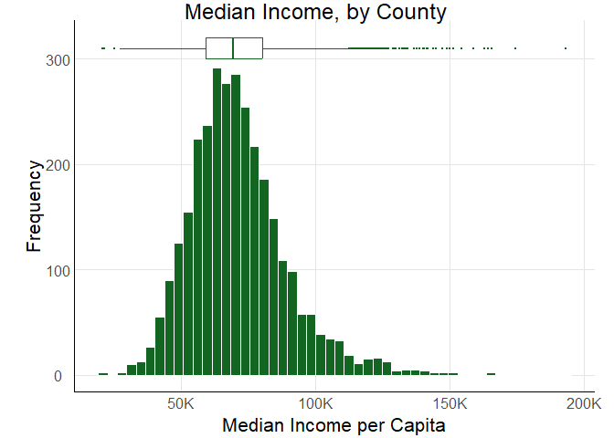
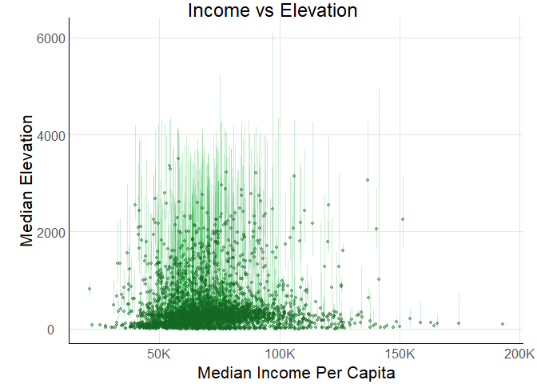
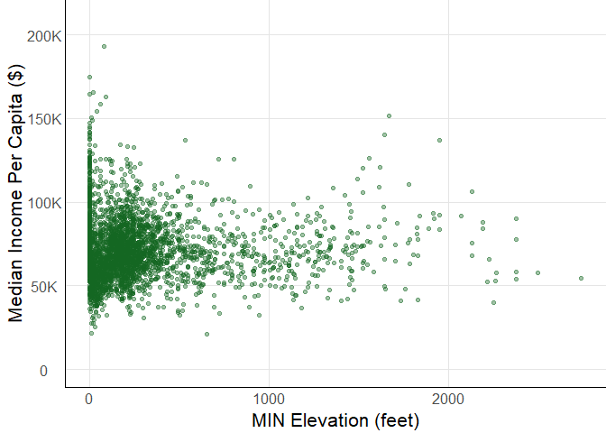
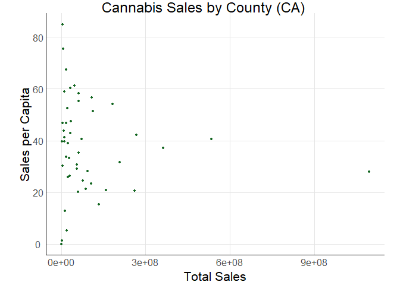
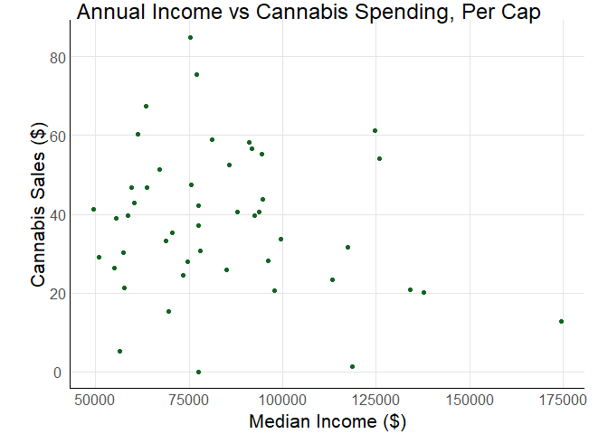

US Income
================
Oliver Buchwald
2025-04-03

- [Grading Rubric](#grading-rubric)
  - [Individual](#individual)
  - [Submission](#submission)
- [Setup](#setup)
  - [**q1** Load the population data from c06; simply replace
    `filename_pop`
    below.](#q1-load-the-population-data-from-c06-simply-replace-filename_pop-below)
  - [**q2** Obtain median income data from the Census
    Bureau:](#q2-obtain-median-income-data-from-the-census-bureau)
  - [**q3** Tidy the `df_income` dataset by completing the code below.
    Pivot and rename the columns to arrive at the column names
    `id, geographic_area_name, category, income_estimate, income_moe`.](#q3-tidy-the-df_income-dataset-by-completing-the-code-below-pivot-and-rename-the-columns-to-arrive-at-the-column-names-id-geographic_area_name-category-income_estimate-income_moe)
  - [**q4** Convert the margin of error to standard error. Additionally,
    compute a 99% confidence interval on income, and normalize the
    standard error to `income_CV = income_SE / income_estimate`. Provide
    these columns with the names
    `income_SE, income_lo, income_hi, income_CV`.](#q4-convert-the-margin-of-error-to-standard-error-additionally-compute-a-99-confidence-interval-on-income-and-normalize-the-standard-error-to-income_cv--income_se--income_estimate-provide-these-columns-with-the-names-income_se-income_lo-income_hi-income_cv)
  - [**q5** Join `df_q4` and `df_pop`.](#q5-join-df_q4-and-df_pop)
- [Analysis](#analysis)
  - [**q6** Study the following graph, making sure to note what you can
    *and can’t* conclude based on the estimates and confidence
    intervals. Document your observations below and answer the
    questions.](#q6-study-the-following-graph-making-sure-to-note-what-you-can-and-cant-conclude-based-on-the-estimates-and-confidence-intervals-document-your-observations-below-and-answer-the-questions)
  - [**q7** Plot the standard error against population for all counties.
    Create a visual that effectively highlights the trends in the data.
    Answer the questions under *observations*
    below.](#q7-plot-the-standard-error-against-population-for-all-counties-create-a-visual-that-effectively-highlights-the-trends-in-the-data-answer-the-questions-under-observations-below)
- [Going Further](#going-further)
  - [**q8** Pose your own question about the data. Create a
    visualization (or table) here, and document your
    observations.](#q8-pose-your-own-question-about-the-data-create-a-visualization-or-table-here-and-document-your-observations)
  - [Guiding Question: Why do some counties have higher income than
    others? what are some characteristics of the highest-income
    counties?](#guiding-question-why-do-some-counties-have-higher-income-than-others-what-are-some-characteristics-of-the-highest-income-counties)
    - [My hypothesis: high income = high
      elevation](#my-hypothesis-high-income--high-elevation)
    - [**Observations:**](#observations)
    - [**New hypothesis: What about the other kind of
      high???**](#new-hypothesis-what-about-the-other-kind-of-high)
    - [Observations](#observations-1)
    - [Observations](#observations-2)
- [References](#references)

*Purpose*: We’ve been learning how to quantify uncertainty in estimates
through the exercises; now its time to put those skills to use studying
real data. In this challenge we’ll use concepts like confidence
intervals to help us make sense of census data.

*Reading*: - [Using ACS Estimates and Margin of
Error](https://www.census.gov/data/academy/webinars/2020/calculating-margins-of-error-acs.html)
(Optional, see the PDF on the page) - [Patterns and Causes of
Uncertainty in the American Community
Survey](https://www.sciencedirect.com/science/article/pii/S0143622813002518?casa_token=VddzQ1-spHMAAAAA:FTq92LXgiPVloJUVjnHs8Ma1HwvPigisAYtzfqaGbbRRwoknNq56Y2IzszmGgIGH4JAPzQN0)
(Optional, particularly the *Uncertainty in surveys* section under the
Introduction.)

<!-- include-rubric -->

# Grading Rubric

<!-- -------------------------------------------------- -->

Unlike exercises, **challenges will be graded**. The following rubrics
define how you will be graded, both on an individual and team basis.

## Individual

<!-- ------------------------- -->

| Category | Needs Improvement | Satisfactory |
|----|----|----|
| Effort | Some task **q**’s left unattempted | All task **q**’s attempted |
| Observed | Did not document observations, or observations incorrect | Documented correct observations based on analysis |
| Supported | Some observations not clearly supported by analysis | All observations clearly supported by analysis (table, graph, etc.) |
| Assessed | Observations include claims not supported by the data, or reflect a level of certainty not warranted by the data | Observations are appropriately qualified by the quality & relevance of the data and (in)conclusiveness of the support |
| Specified | Uses the phrase “more data are necessary” without clarification | Any statement that “more data are necessary” specifies which *specific* data are needed to answer what *specific* question |
| Code Styled | Violations of the [style guide](https://style.tidyverse.org/) hinder readability | Code sufficiently close to the [style guide](https://style.tidyverse.org/) |

## Submission

<!-- ------------------------- -->

Make sure to commit both the challenge report (`report.md` file) and
supporting files (`report_files/` folder) when you are done! Then submit
a link to Canvas. **Your Challenge submission is not complete without
all files uploaded to GitHub.**

# Setup

<!-- ----------------------------------------------------------------------- -->

``` r
library(tidyverse)
```

    ## ── Attaching core tidyverse packages ──────────────────────── tidyverse 2.0.0 ──
    ## ✔ dplyr     1.1.4     ✔ readr     2.1.5
    ## ✔ forcats   1.0.0     ✔ stringr   1.5.1
    ## ✔ ggplot2   3.5.1     ✔ tibble    3.2.1
    ## ✔ lubridate 1.9.4     ✔ tidyr     1.3.1
    ## ✔ purrr     1.0.4     
    ## ── Conflicts ────────────────────────────────────────── tidyverse_conflicts() ──
    ## ✖ dplyr::filter() masks stats::filter()
    ## ✖ dplyr::lag()    masks stats::lag()
    ## ℹ Use the conflicted package (<http://conflicted.r-lib.org/>) to force all conflicts to become errors

### **q1** Load the population data from c06; simply replace `filename_pop` below.

``` r
## TODO: Give the filename for your copy of Table B01003
filename_pop <- "./data/ACSDT5Y2018.B01003-Data.csv"
## NOTE: No need to edit
df_pop <-
  read_csv(
    filename_pop,
    skip = 1,
  ) %>% 
  rename(
    population_estimate = `Estimate!!Total`
  )
```

    ## New names:
    ## Rows: 3220 Columns: 5
    ## ── Column specification
    ## ──────────────────────────────────────────────────────── Delimiter: "," chr
    ## (3): Geography, Geographic Area Name, Margin of Error!!Total dbl (1):
    ## Estimate!!Total lgl (1): ...5
    ## ℹ Use `spec()` to retrieve the full column specification for this data. ℹ
    ## Specify the column types or set `show_col_types = FALSE` to quiet this message.
    ## • `` -> `...5`

``` r
df_pop
```

    ## # A tibble: 3,220 × 5
    ##    Geography   `Geographic Area Name` population_estimate Margin of Error!!Tot…¹
    ##    <chr>       <chr>                                <dbl> <chr>                 
    ##  1 0500000US0… Autauga County, Alaba…               55200 *****                 
    ##  2 0500000US0… Baldwin County, Alaba…              208107 *****                 
    ##  3 0500000US0… Barbour County, Alaba…               25782 *****                 
    ##  4 0500000US0… Bibb County, Alabama                 22527 *****                 
    ##  5 0500000US0… Blount County, Alabama               57645 *****                 
    ##  6 0500000US0… Bullock County, Alaba…               10352 *****                 
    ##  7 0500000US0… Butler County, Alabama               20025 *****                 
    ##  8 0500000US0… Calhoun County, Alaba…              115098 *****                 
    ##  9 0500000US0… Chambers County, Alab…               33826 *****                 
    ## 10 0500000US0… Cherokee County, Alab…               25853 *****                 
    ## # ℹ 3,210 more rows
    ## # ℹ abbreviated name: ¹​`Margin of Error!!Total`
    ## # ℹ 1 more variable: ...5 <lgl>

You might wonder why the `Margin of Error` in the population estimates
is listed as `*****`. From the [documentation (PDF
link)](https://www.google.com/url?sa=t&rct=j&q=&esrc=s&source=web&cd=&cad=rja&uact=8&ved=2ahUKEwj81Omy16TrAhXsguAKHTzKDQEQFjABegQIBxAB&url=https%3A%2F%2Fwww2.census.gov%2Fprograms-surveys%2Facs%2Ftech_docs%2Faccuracy%2FMultiyearACSAccuracyofData2018.pdf%3F&usg=AOvVaw2TOrVuBDlkDI2gde6ugce_)
for the ACS:

> If the margin of error is displayed as ‘\*\*\*\*\*’ (five asterisks),
> the estimate has been controlled to be equal to a fixed value and so
> it has no sampling error. A standard error of zero should be used for
> these controlled estimates when completing calculations, such as those
> in the following section.

This means that for cases listed as `*****` the US Census Bureau
recommends treating the margin of error (and thus standard error) as
zero.

### **q2** Obtain median income data from the Census Bureau:

- `Filter > Topics > Income and Poverty > Income and Poverty`
- `Filter > Geography > County > All counties in United States`
- Look for `Median Income in the Past 12 Months` (Table S1903)
- Download the 2018 5-year ACS estimates; save to your `data` folder and
  add the filename below.

``` r
## TODO: Give the filename for your copy of Table S1903
filename_income <- "./data/income.csv"

## NOTE: No need to edit
df_income <-
  read_csv(filename_income, skip = 1)
```

    ## Warning: One or more parsing issues, call `problems()` on your data frame for details,
    ## e.g.:
    ##   dat <- vroom(...)
    ##   problems(dat)

    ## Rows: 3220 Columns: 482
    ## ── Column specification ────────────────────────────────────────────────────────
    ## Delimiter: ","
    ## chr (306): Geography, Geographic Area Name, Annotation of Margin of Error!!N...
    ## dbl (176): Estimate!!Number!!HOUSEHOLD INCOME BY RACE AND HISPANIC OR LATINO...
    ## 
    ## ℹ Use `spec()` to retrieve the full column specification for this data.
    ## ℹ Specify the column types or set `show_col_types = FALSE` to quiet this message.

``` r
df_income
```

    ## # A tibble: 3,220 × 482
    ##    Geography      `Geographic Area Name`   Estimate!!Number!!HOUSEHOLD INCOME …¹
    ##    <chr>          <chr>                                                    <dbl>
    ##  1 0500000US01001 Autauga County, Alabama                                  21115
    ##  2 0500000US01003 Baldwin County, Alabama                                  78622
    ##  3 0500000US01005 Barbour County, Alabama                                   9186
    ##  4 0500000US01007 Bibb County, Alabama                                      6840
    ##  5 0500000US01009 Blount County, Alabama                                   20600
    ##  6 0500000US01011 Bullock County, Alabama                                   3609
    ##  7 0500000US01013 Butler County, Alabama                                    6708
    ##  8 0500000US01015 Calhoun County, Alabama                                  45033
    ##  9 0500000US01017 Chambers County, Alabama                                 13516
    ## 10 0500000US01019 Cherokee County, Alabama                                 10606
    ## # ℹ 3,210 more rows
    ## # ℹ abbreviated name:
    ## #   ¹​`Estimate!!Number!!HOUSEHOLD INCOME BY RACE AND HISPANIC OR LATINO ORIGIN OF HOUSEHOLDER!!Households`
    ## # ℹ 479 more variables:
    ## #   `Margin of Error!!Number MOE!!HOUSEHOLD INCOME BY RACE AND HISPANIC OR LATINO ORIGIN OF HOUSEHOLDER!!Households` <dbl>,
    ## #   `Annotation of Margin of Error!!Number MOE!!HOUSEHOLD INCOME BY RACE AND HISPANIC OR LATINO ORIGIN OF HOUSEHOLDER!!Households` <chr>,
    ## #   `Annotation of Estimate!!Number!!HOUSEHOLD INCOME BY RACE AND HISPANIC OR LATINO ORIGIN OF HOUSEHOLDER!!Households` <chr>, …

Use the following test to check that you downloaded the correct file:

``` r
## NOTE: No need to edit, use to check you got the right file.
assertthat::assert_that(
  df_income %>%
    filter(Geography == "0500000US01001") %>%
    pull(`Estimate!!Percent Distribution!!FAMILY INCOME BY FAMILY SIZE!!2-person families`)
  == 45.6
)
```

    ## [1] TRUE

``` r
print("Well done!")
```

    ## [1] "Well done!"

This dataset is in desperate need of some *tidying*. To simplify the
task, we’ll start by considering the `\\d-person families` columns
first.

### **q3** Tidy the `df_income` dataset by completing the code below. Pivot and rename the columns to arrive at the column names `id, geographic_area_name, category, income_estimate, income_moe`.

*Hint*: You can do this in a single pivot using the `".value"` argument
and a `names_pattern` using capture groups `"()"`. Remember that you can
use an OR operator `|` in a regex to allow for multiple possibilities in
a capture group, for example `"(Estimate|Margin of Error)"`.

``` r
df_q3 <-
  df_income %>%
  select(
    Geography,
    contains("Geographic"),
    # This will select only the numeric d-person family columns;
    # it will ignore the annotation columns
    contains("median") & matches("\\d-person families") & !contains("Annotation of")
  ) %>%
  mutate(across(contains("median"), as.numeric)) %>%
  pivot_longer(
    names_pattern = "(Estimate|Margin of Error).*(\\d-person families).*",
    names_to = c(".value", "category"),
    cols = matches("(Estimate|Margin of Error)")
  ) %>%
  rename("income_estimate" = "Estimate", 
         "income_moe" = "Margin of Error", 
         "geographic_area_name" = "Geographic Area Name") %>%
  glimpse()
```

    ## Warning: There were 8 warnings in `mutate()`.
    ## The first warning was:
    ## ℹ In argument: `across(contains("median"), as.numeric)`.
    ## Caused by warning:
    ## ! NAs introduced by coercion
    ## ℹ Run `dplyr::last_dplyr_warnings()` to see the 7 remaining warnings.

    ## Rows: 16,100
    ## Columns: 5
    ## $ Geography            <chr> "0500000US01001", "0500000US01001", "0500000US010…
    ## $ geographic_area_name <chr> "Autauga County, Alabama", "Autauga County, Alaba…
    ## $ category             <chr> "2-person families", "3-person families", "4-pers…
    ## $ income_estimate      <dbl> 64947, 80172, 85455, 88601, 103787, 63975, 79390,…
    ## $ income_moe           <dbl> 6663, 14181, 10692, 20739, 12387, 2297, 8851, 519…

Use the following tests to check your work:

``` r
## NOTE: No need to edit
assertthat::assert_that(setequal(
  names(df_q3),
  c("Geography", "geographic_area_name", "category", "income_estimate", "income_moe")
))
```

    ## [1] TRUE

``` r
assertthat::assert_that(
  df_q3 %>%
    filter(Geography == "0500000US01001", category == "2-person families") %>%
    pull(income_moe)
  == 6663
)
```

    ## [1] TRUE

``` r
print("Nice!")
```

    ## [1] "Nice!"

The data gives finite values for the Margin of Error, which is closely
related to the Standard Error. The Census Bureau documentation gives the
following relationship between Margin of Error and Standard Error:

$$\text{MOE} = 1.645 \times \text{SE}.$$

### **q4** Convert the margin of error to standard error. Additionally, compute a 99% confidence interval on income, and normalize the standard error to `income_CV = income_SE / income_estimate`. Provide these columns with the names `income_SE, income_lo, income_hi, income_CV`.

``` r
df_q4 <- 
  df_q3 %>% 
  mutate(income_SE = income_moe / 1.645,
         income_CV = income_SE / income_estimate,
         income_lo = income_estimate - 2.576 * income_SE,
         income_hi = income_estimate + 2.576 * income_SE)
```

Use the following tests to check your work:

``` r
## NOTE: No need to edit
assertthat::assert_that(setequal(
  names(df_q4),
  c("Geography", "geographic_area_name", "category", "income_estimate", "income_moe",
    "income_SE", "income_lo", "income_hi", "income_CV")
))
```

    ## [1] TRUE

``` r
assertthat::assert_that(
  abs(
    df_q4 %>%
    filter(Geography == "0500000US01001", category == "2-person families") %>%
    pull(income_SE) - 4050.456
  ) / 4050.456 < 1e-3
)
```

    ## [1] TRUE

``` r
assertthat::assert_that(
  abs(
    df_q4 %>%
    filter(Geography == "0500000US01001", category == "2-person families") %>%
    pull(income_lo) - 54513.72
  ) / 54513.72 < 1e-3
)
```

    ## [1] TRUE

``` r
assertthat::assert_that(
  abs(
    df_q4 %>%
    filter(Geography == "0500000US01001", category == "2-person families") %>%
    pull(income_hi) - 75380.28
  ) / 75380.28 < 1e-3
)
```

    ## [1] TRUE

``` r
assertthat::assert_that(
  abs(
    df_q4 %>%
    filter(Geography == "0500000US01001", category == "2-person families") %>%
    pull(income_CV) - 0.06236556
  ) / 0.06236556 < 1e-3
)
```

    ## [1] TRUE

``` r
print("Nice!")
```

    ## [1] "Nice!"

One last wrangling step: We need to join the two datasets so we can
compare population with income.

### **q5** Join `df_q4` and `df_pop`.

``` r
## TODO: Join df_q4 and df_pop by the appropriate column
df_data <- 
  left_join(df_q4, df_pop, by = "Geography")
```

# Analysis

<!-- ----------------------------------------------------------------------- -->

We now have both estimates and confidence intervals for
`\\d-person families`. Now we can compare cases with quantified
uncertainties: Let’s practice!

### **q6** Study the following graph, making sure to note what you can *and can’t* conclude based on the estimates and confidence intervals. Document your observations below and answer the questions.

``` r
## NOTE: No need to edit; run and inspect
wid <- 0.5

df_data %>%
  filter(str_detect(geographic_area_name, "Massachusetts")) %>%
  mutate(
    county = str_remove(geographic_area_name, " County,.*$"),
    county = fct_reorder(county, income_estimate)
  ) %>%

  ggplot(aes(county, income_estimate, color = category)) +
  geom_errorbar(
    aes(ymin = income_lo, ymax = income_hi),
    position = position_dodge(width = wid)
  ) +
  geom_point(position = position_dodge(width = wid)) +

  coord_flip() +
  labs(
    x = "County",
    y = "Median Household Income"
  )
```

    ## Warning: There was 1 warning in `mutate()`.
    ## ℹ In argument: `county = fct_reorder(county, income_estimate)`.
    ## Caused by warning:
    ## ! `fct_reorder()` removing 2 missing values.
    ## ℹ Use `.na_rm = TRUE` to silence this message.
    ## ℹ Use `.na_rm = FALSE` to preserve NAs.

    ## Warning: Removed 2 rows containing missing values or values outside the scale range
    ## (`geom_point()`).

<!-- -->

**Observations**:

- Document your observations here.
  - On average, smaller household sizes have a smaller margin of error
  - Nantucket has a crazy wide income spread
  - Generally 4-6 person households have higher income than 2-3 person
    households, but income does not scale proportionally per person in
    bigger households. Bigger households also tend to have wider error
    bars
- Can you confidently distinguish between household incomes in Suffolk
  county? Why or why not?
  - Not really, the dots are very close together and within each others
    error bars.
- Which counties have the widest confidence intervals?
  - Nantucket is crazy, as previously stated
  - Hampshire, Dukes, and Berkshire are also pretty wide

In the next task you’ll investigate the relationship between population
and uncertainty.

### **q7** Plot the standard error against population for all counties. Create a visual that effectively highlights the trends in the data. Answer the questions under *observations* below.

*Hint*: Remember that standard error is a function of *both* variability
(e.g. variance) and sample size.

``` r
df_data %>%
  ggplot(aes(x = population_estimate, y = income_SE, color = category, group = 1)) +
  geom_point(alpha = 0.1) +
  theme_minimal() +
  scale_y_log10() +
  scale_x_log10() +
  geom_smooth()
```

    ## `geom_smooth()` using method = 'gam' and formula = 'y ~ s(x, bs = "cs")'

    ## Warning: Removed 814 rows containing non-finite outside the scale range
    ## (`stat_smooth()`).

    ## Warning: The following aesthetics were dropped during statistical transformation:
    ## colour.
    ## ℹ This can happen when ggplot fails to infer the correct grouping structure in
    ##   the data.
    ## ℹ Did you forget to specify a `group` aesthetic or to convert a numerical
    ##   variable into a factor?

    ## Warning: Removed 814 rows containing missing values or values outside the scale range
    ## (`geom_point()`).

<!-- -->

**Observations**:

- What *overall* trend do you see between `SE` and population? Why might
  this trend exist?
  - low population = high standard error
  - At a low population, there are more likely to be fewer samples -
    this may happen if data collection is proportional to population, or
    collected in a way that is tied to population.
  - Fewer samples means that there are less data points to average out
    and therefore each individual datapoint having more of an influence
    on the median/mean
- What does this *overall* trend tell you about the relative ease of
  studying small vs large counties?
  - Large counties are easier to estimate based on incomplete data

# Going Further

<!-- ----------------------------------------------------------------------- -->

Now it’s your turn! You have income data for every county in the United
States: Pose your own question and try to answer it with the data.

### **q8** Pose your own question about the data. Create a visualization (or table) here, and document your observations.

Ideas:

- Compare trends across counties that are relevant to you; e.g. places
  you’ve lived, places you’ve been, places in the US that are
  interesting to you.

- In q3 we tidied the median `\\d-person families` columns only.

  - Tidy the other median columns to learn about other people groups.
  - Tidy the percentage columns to learn about how many households of
    each category are in each county.

- ## Your own idea!

Firstly, theme template for prettier plots, since this is going into a
presentation

``` r
## NOTE: No need to edit; feel free to re-use this code!
theme_common <- function() {
  theme_minimal() %+replace%
  theme(
    axis.text.x = element_text(size = 12),
    axis.text.y = element_text(size = 12, margin = margin(b = 10)),
    axis.title.x = element_text(margin = margin(4, 4, 4, 4), size = 16),
    axis.title.y = element_text(margin = margin(4, 4, 4, 4), size = 16, angle = 90),

    legend.title = element_text(size = 16),
    legend.text = element_text(size = 12),

    strip.text.x = element_text(size = 12),
    strip.text.y = element_text(size = 12),

    panel.grid.major = element_line(color = "grey90"),
    panel.grid.minor = element_blank(), # element_line(color = "grey90"),
    axis.line = element_line(),

    aspect.ratio = 5 / 7,

    plot.margin = unit(c(t = +0, b = +0, r = +0, l = +0), "cm"),
    plot.title = element_text(size = 18, margin = margin(l = 10)),
    plot.title.position = "plot",
    plot.subtitle = element_text(size = 16),
    plot.caption = element_text(size = 12),
    
    plot.background = element_rect(fill = "transparent", color = NA),
    panel.background = element_rect(fill = "transparent", color = NA)
  )
}
```

## Guiding Question: Why do some counties have higher income than others? what are some characteristics of the highest-income counties?

### My hypothesis: high income = high elevation

Additional data is sourced from USGS DEM data for elevation, and
formatted by this dude on reddit into an excel sheet
<https://www.reddit.com/r/gis/comments/xjnibn/usa_average_county_elevation/>

Then Sparsh did some processing magic to merge it with the income data
from the previous questions, which we normalized per capita to remove
the variation based on household size. Keeping that in would make this
analysis more complicated than it needs to be

``` r
## load addl data
df_elevation <-
  read_csv("./data/income_elevation.csv")
```

    ## Rows: 3134 Columns: 18
    ## ── Column specification ────────────────────────────────────────────────────────
    ## Delimiter: ","
    ## chr  (3): FIPS, NAME, STATE_NAME
    ## dbl (15): normalized_income_estimate, normalized_income_moe, population_esti...
    ## 
    ## ℹ Use `spec()` to retrieve the full column specification for this data.
    ## ℹ Specify the column types or set `show_col_types = FALSE` to quiet this message.

``` r
#county income variation
df_elevation %>%
  ggplot(aes(x = normalized_income_estimate)) +
  # geom_histogram(bins = 50, fill = "#136621ff") +
  geom_density(color = "#136621ff", linewidth = 1.25) +
  geom_boxplot(aes( y = 0.00003), width = 0.000005) +
  labs(title = "Density of Income, by County",
       x = "Median Income per Capita",
       y = "Density") +
  scale_x_continuous(labels = scales::label_number(scale_cut = scales::cut_short_scale())) +
  scale_y_continuous(labels = scales::label_number(scale_cut = scales::cut_short_scale())) +
  theme_common()
```

<!-- -->

``` r
#histogram of county income
df_elevation %>%
  ggplot(aes(x = normalized_income_estimate)) +
  geom_histogram(bins = 50, 
                 fill = "#136621ff", 
                 color = "white", 
                 width = 0.9) +
  geom_boxplot(aes( y = 310), width = 20, color = "#136621ff", outlier.size= 0.1) +
  labs(title = " Median Income, by County",
       x = "Median Income per Capita",
       y = "Frequency") +
  scale_x_continuous(labels = scales::label_number(scale_cut = scales::cut_short_scale())) +
  theme_common()
```

<!-- -->

``` r
#numerical summary

df_elevation %>%
  summarise(
    median = median(normalized_income_estimate),
    q1 = quantile(normalized_income_estimate, 0.25),
    q3 = quantile(normalized_income_estimate, 0.75),
    iqr = q3 - q1,
    upper_bound = q3 + 1.5 * iqr
  )
```

    ## # A tibble: 1 × 5
    ##   median     q1     q3    iqr upper_bound
    ##    <dbl>  <dbl>  <dbl>  <dbl>       <dbl>
    ## 1 69436. 59271. 80572. 21302.     112525.

**Observations**:

- Wow, there are counties
- Wow, they have incomes
- Median income is around 69K and the IQR ranges from ~59-81k
- Anything above **112k** is an outlier based on the boxplot. I’m using
  this number as a reference point for what counts as high income in
  later sections

``` r
#income v elevation with std deviation

df_elevation %>%
  ggplot(aes(x = normalized_income_estimate, y = MEDIAN, size = STD)) +
  geom_point(alpha = 0.2, color = "#136621ff") +
  labs(title = "Income vs Elevation, By County",
       x = "Median Income Per Capita",
       y = "Median Elevation") +
  scale_x_continuous(labels = scales::label_number(scale_cut = scales::cut_short_scale())) +
  theme_common()
```

<!-- -->

``` r
# income vs elevation with minmax error bars
df_elevation %>%
  ggplot(aes(x = normalized_income_estimate, y = MEDIAN)) +
  geom_errorbar(aes(ymin = MIN, ymax = MAX), width = 0, color = "#00a724ff", alpha = 0.2) +  # vertical error bars
  geom_point(alpha = 0.4, size = 1, color = "#136621ff") +
  labs(title = "Income vs Elevation",
       x = "Median Income Per Capita",
       y = "Median Elevation") +
  scale_x_continuous(labels = scales::label_number(scale_cut = scales::cut_short_scale())) +
  theme_common()
```

<!-- -->

``` r
# income vs max elevation

df_elevation %>%
  # filter(normalized_income_estimate >= quantile(normalized_income_estimate, 0.75, na.rm = TRUE)) %>%
  ggplot(aes(x = normalized_income_estimate, y = MAX)) +
  geom_point(alpha = 0.4, color = "#136621ff") +
  labs(title = "Income vs Max Elevation, By County",
       x = "Median Income Per Capita",
       y = "MAX Elevation") +
  scale_x_continuous(labels = scales::label_number(scale_cut = scales::cut_short_scale())) +
  theme_common()
```

<!-- -->

``` r
# income vs MIN elevation

df_elevation %>%
  # filter(normalized_income_estimate >= quantile(normalized_income_estimate, 0.75, na.rm = TRUE)) %>%
  ggplot(aes(y = normalized_income_estimate, x = MIN)) +
  geom_point(alpha = 0.4, color = "#136621ff") +
  labs(#title = "Lowest Elevation vs Income, By County",
       y = "Median Income Per Capita ($)",
       x = "MIN Elevation (feet)") +
  scale_y_continuous(limits= c(0,210000),
    labels = scales::label_number(scale_cut = scales::cut_short_scale())) +
  theme_common()
```

<!-- -->

``` r
# low income vs low elevation

df_elevation %>%
  filter(normalized_income_estimate <= quantile(normalized_income_estimate, 0.25, na.rm = TRUE)) %>%
  ggplot(aes(x = normalized_income_estimate, y = MAX)) +
  geom_point(alpha = 0.4, color = "#136621ff") +
  labs(title = "Income vs  Elevation, By County, lower 25th percentile",
       x = "Median Income Per Capita",
       y = "MIN Elevation") +
  scale_x_continuous(labels = scales::label_number(scale_cut = scales::cut_short_scale())) +
  theme_common()
```

<!-- -->

  

**Observations**:

- Seems like there’s not a strong trend here. My hypothesis that higher
  income individuals would be more likely to live in the mountains seems
  pretty false, likely correlated by the fact that there are less cities
  or opportunities for employment at high elevations typically.
- However, there does seem to be some relationship between high-income
  counties being more commonly having a minimum elevation at sea level.
  This does not distinguish particularly high-income counties (there are
  also plenty of low-median-income and middle income counties at sea
  level) but is a defining characteristic of the highest income
  counties. I guess high income earners prefer the beach over the
  mountains (or are likely skewed by a higher concentration of cities on
  the coastlines)

``` r
df_elevation_moe <-
  df_elevation %>%
  mutate(income_SE = normalized_income_moe / 1.645,
         income_CV = income_SE / normalized_income_estimate,
         income_lo = normalized_income_estimate - 2.576 * income_SE,
         income_hi = normalized_income_estimate + 2.576 * income_SE,
         elevation_SE = STD/sqrt(COUNT),
         elevation_CV = elevation_SE/MEAN,
         elevation_lo = MEAN - 2.576 * elevation_SE,
         elevation_hi = MEAN + 2.576 * elevation_SE,
         elevation = MEAN)

# income vs elevation with MOE
df_elevation_moe %>%
  ggplot(aes(y = normalized_income_estimate, x = MEDIAN)) +
  # geom_errorbarh(aes(xmin = MIN, xmax = MAX), color = "#00a724ff", alpha = 0.05) +  
  
  geom_hline(yintercept = 69435, color="#136621ff", linewidth = 1.4) +
  geom_errorbar(aes(ymin= pmax(income_lo, 0), ymax= pmin(income_hi,290000)), color = "#00a724ff", alpha = 0.10) +
  geom_point(alpha = 0.4, size = 1, color = "#136621ff") +
  labs(title = "Income vs Elevation, by County",
       y="Income ($ per Capita)",
       x= "Median Elevation (Feet)") +
  # scale_x_continuous(limits = c(0,250000)) +
  scale_y_continuous(limits = c(0,290000),
                      labels = scales::label_number(scale_cut = scales::cut_short_scale())) +
  
  geom_hline(yintercept = 69435, color="white", linewidth = 0.5) +
  theme_common()
```

<!-- -->

### **Observations:**

- Tried remaking those plots with various error bars based on all the
  stuff in the first half of the assigment. IMO its more info than we
  need or want and makes the graph ugly
- This graph shows no trends. At higher elevations, one could argue that
  income is closer to the median and at least the 1.5x IQR. But it
  really follows the overall trend and there is nothing here - the error
  bars just drive that point home
- However - the handful of richest counties being at lower elevations
  generally does kind of hold true here. idk, I think this avenue of
  investigation was kind of a bust, but i stand by the minimum elevation
  plot from earlier having some merit.
- Also, varying whether x on this plot is median, min or max gets some
  interesting data, I don’t want to make this file any longer, but
  setting it to MAX elevation almost suggests that income in counties at
  high elevation is a bit more skewed than the US as a whole, so at high
  elevation counties are more likely to have slighlty above-median
  incomes
- I almost want to make another plot where counties are bucketed by 1000
  ft intervals and its a boxplot for each elevation tier. But tbh there
  is no trend, I’m just looking to prove a hypothesis that doesn’t make
  sense

**Maybe we’re on the wrong track**

### **New hypothesis: What about the other kind of high???**

For this, we pulled additional data from the California department of
tax & fee administration regarding cannabis sales by county.
(<https://www.cdtfa.ca.gov/dataportal/dataset.htm?url=CannabisSalesByCounty>)

Similar data exists for some other states but not all (Colorado and MA),
but putting it all together would be extremely tedious as each state
formats their data differently, so we decided to focus in on CA for
having both coastlines and mountains and being a pretty big state. Again
s/o to Sparsh for formatting the data nicely

``` r
## load addl data
df_high <-
  read_csv("./data/income_elevation_cannabis_ca.csv")
```

    ## Rows: 47 Columns: 20
    ## ── Column specification ────────────────────────────────────────────────────────
    ## Delimiter: ","
    ## chr  (2): NAME, STATE_NAME
    ## dbl (18): FIPS, normalized_income_estimate, normalized_income_moe, populatio...
    ## 
    ## ℹ Use `spec()` to retrieve the full column specification for this data.
    ## ℹ Specify the column types or set `show_col_types = FALSE` to quiet this message.

``` r
df_high %>%
  ggplot(aes(x = `Total Taxable Sales`, y = `Per Capita Sales`)) +
  geom_point(size = 1, color = "#136621ff") +
  labs(title = "Cannabis Sales by County (CA)",
       x = "Total Sales",
       y = "Sales per Capita") +
  theme_common()
```

<!-- -->

``` r
#another plot of raw data
df_high %>%
  ggplot(aes(x = population_estimate, y = `Total Taxable Sales`)) +
  geom_point(size = 1.5, color = "#136621ff", alpha = 0.8) +
  labs(title = "Population vs Cannabis Sales by County (CA)",
       x = "Population",
       y = " Annual Cannabis Sales ($)") +
   scale_x_log10(labels = scales::label_number(scale_cut = scales::cut_short_scale())) +
   scale_y_log10(labels = scales::label_number(scale_cut = scales::cut_short_scale())) +
  theme_common()
```

<!-- -->

### Observations

- Population and cannabis sales have a fairly direct relationship and we
  should normalize them. This graph is really just for the slideshow

``` r
#initial comparison
df_high %>%
  ggplot(aes(x = normalized_income_estimate, y = `Per Capita Sales`)) +
  # geom_smooth(data = . %>%filter(`Per Capita Sales` > 10),
  #             aes(x = normalized_income_estimate, y = `Per Capita Sales`),
  #             color = "#004d00", 
  #             fill = "#ccffcc"
  #             ) +
  geom_point(size = 1.5, color = "#136621ff") +
  # 
  # geom_boxplot(aes(x = normalized_income_estimate, y = -20), 
  #   width = 10, 
  #   color = "#136621ff",
  #   alpha = 0.5) +
  # geom_boxplot(aes(y = `Per Capita Sales`, x = 40000), 
  #   width = 10000, 
  #   color = "#136621ff",
  #   alpha = 0.5) +
  labs(title = "Annual Income vs Cannabis Spending, Per Cap",
       x = "Median Income ($)",
       y = "Cannabis Sales ($)") +
  theme_common()
```

<!-- -->

``` r
#this is bad I know
df_high %>%
  ggplot(aes(x = normalized_income_estimate, y = `Total Taxable Sales`)) +
  geom_point(size = 1, color = "#136621ff") +
   
  labs(title = "Annual Income vs Total Cannabis Spending",
       x = "Median Income ($)",
       y = "Cannabis Sales ($)") +
  theme_common()
```

<!-- -->

``` r
#conclusion, does high = high?
df_high %>%
  ggplot(aes(x = MEDIAN, y = `Per Capita Sales`)) +
  geom_smooth(data = . %>%filter(`Per Capita Sales` > 10),
              aes(x = MEDIAN, y = `Per Capita Sales`),
              color = "black", 
              fill = "#ccffcc"
              ) +
  geom_point(size = 1.5, color = "#136621ff") +
  geom_point(data = . %>%filter(`Per Capita Sales` < 10),
             aes(x = MEDIAN, y = `Per Capita Sales`),
             size = 1, 
             color = "white",
             alpha = 0.5
             ) +
  labs(title = "Cannabis Sales vs Elevation",
       x = "Median Elevation (feet)",
       y = "Per Capita Sales ($/year)") +
  theme_common()
```

    ## `geom_smooth()` using method = 'loess' and formula = 'y ~ x'

<!-- -->

### Observations

- Spending on weed is highest in counties within the IQR for income.
  Many of the lowest sales are also in this range, in some part due to a
  county with no dispensary which is dragging down the geom_smooth.

- Counties with higher income (\>125000) generally spend less on weed
  per capita

- high income != high weed

- However, high elevation == high sales per capita

- An interesting note is that at least the counties with the three
  lowest sales per capita have county-level bans on cannabis production
  and consumption outside of municipalities where it is otherwise
  legalized. I believe that investigating county-level restrictions will
  get better results, but tbh I’m tired and done for the day

TBH, these slides are probably a better context for my observations:
<https://docs.google.com/presentation/d/1uS7NTo1STrLGv7iQE-cT0DgB6eobSHu7rohDxekZue4/edit?usp=sharing>

# References

<!-- ----------------------------------------------------------------------- -->

\[1\] Spielman SE, Folch DC, Nagle NN (2014) Patterns and causes of
uncertainty in the American Community Survey. Applied Geography 46:
147–157. <pmid:25404783>
[link](https://www.sciencedirect.com/science/article/pii/S0143622813002518?casa_token=VddzQ1-spHMAAAAA:FTq92LXgiPVloJUVjnHs8Ma1HwvPigisAYtzfqaGbbRRwoknNqZ6Y2IzszmGgIGH4JAPzQN0)
